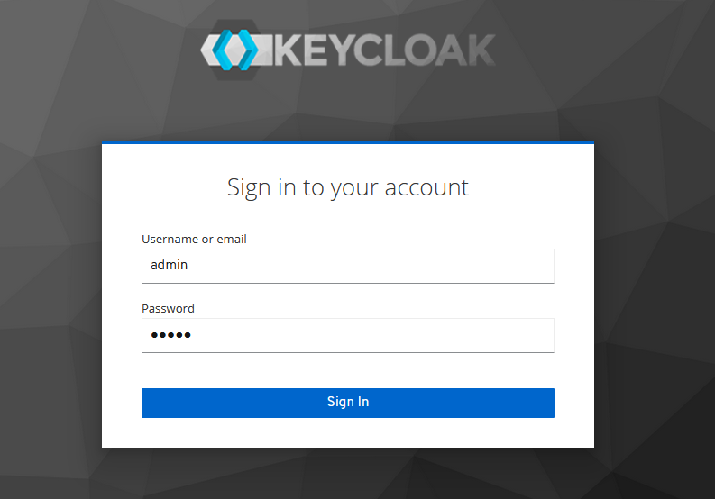
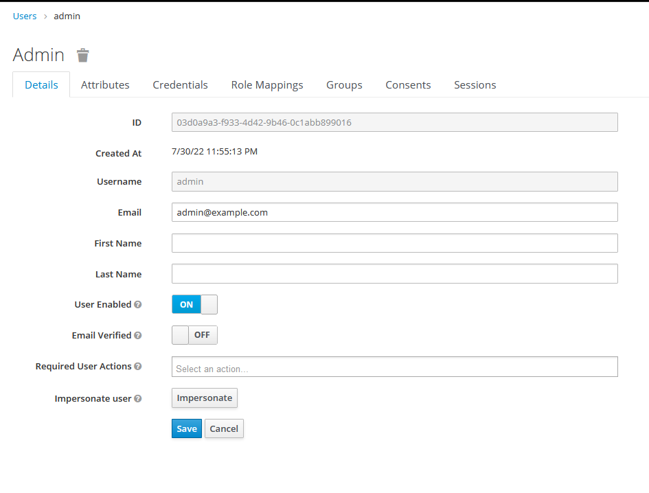
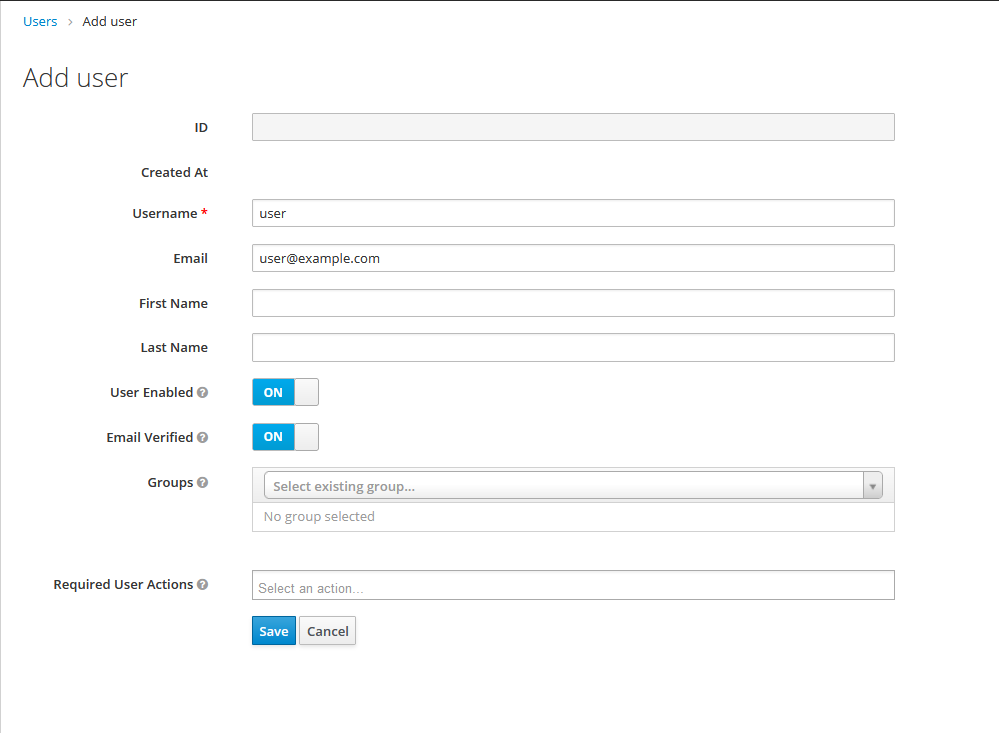
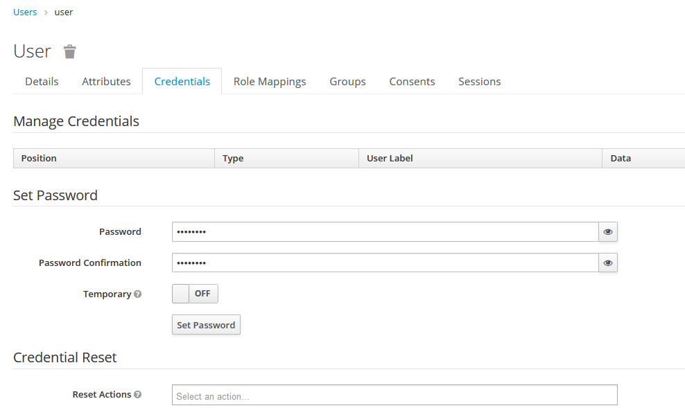
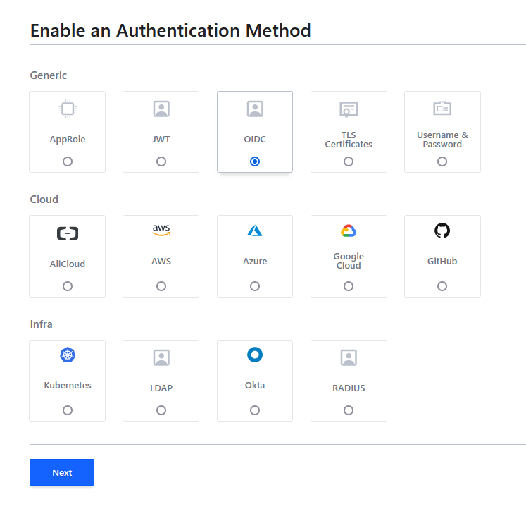
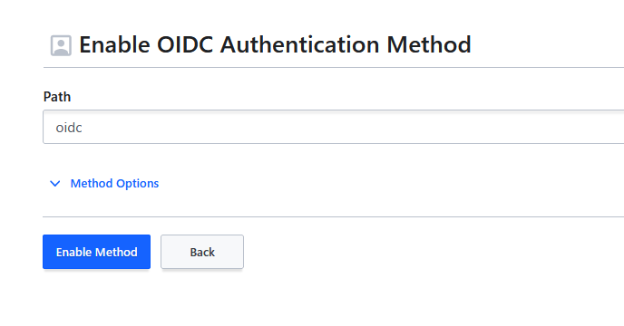
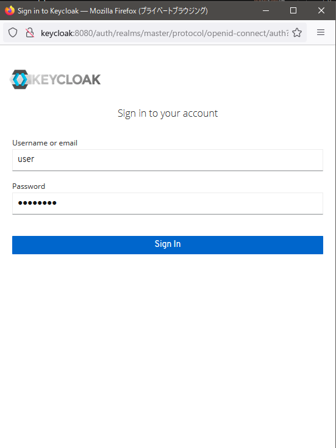
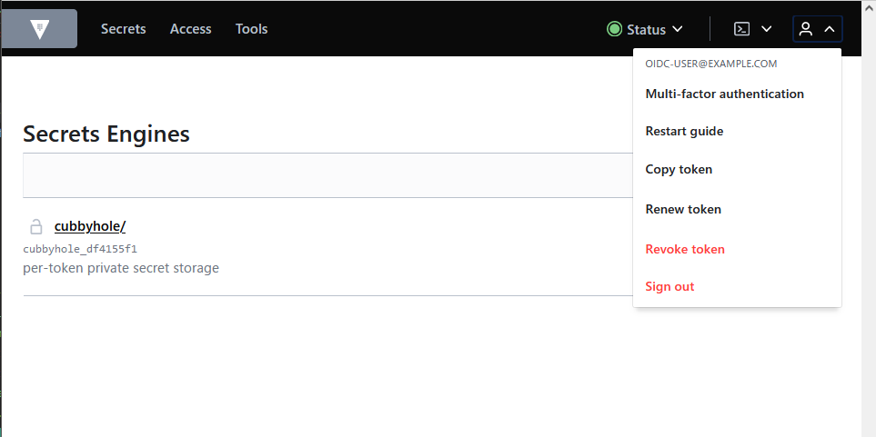
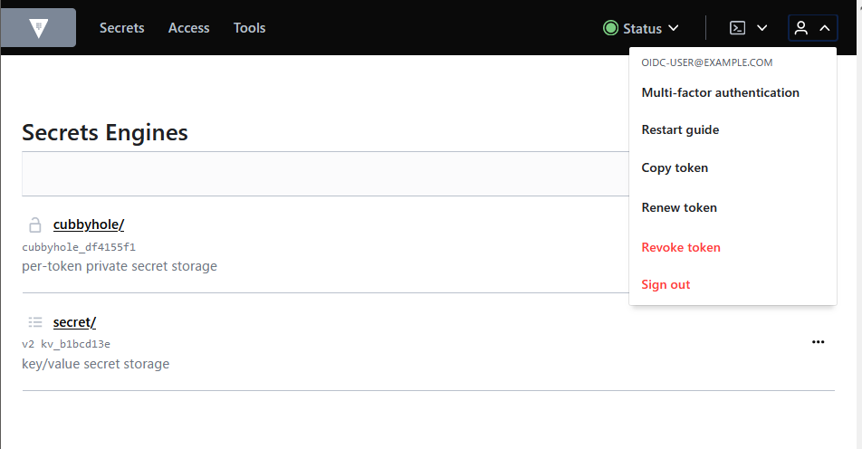

vault の認証に OpenID Connect(oidc)を設定してみました。

## 検証環境

以下の docker-compose.yml を使用しました。(永続化はしていません。)

```yaml
version: "3"

services:
  vault:
    image: vault
    environment:
      VAULT_LOCAL_CONFIG: |-
        {"backend": {"file": {"path": "/vault/file"}}, "default_lease_ttl": "168h", "max_lease_ttl": "720h", "ui": true, "disable_mlock": true}
    ports:
      - 8200:8200
  keycloak:
    image: jboss/keycloak
    ports:
      - 8080:8080
    environment:
      KEYCLOAK_USER: admin
      KEYCLOAK_PASSWORD: admin
```

実行

```bash
$ docker compose up -d
```

また、hosts(Windows は`C:\Windows\System32\drivers\etc\hosts`) に以下を追記します。(vault から keycloak へのアクセスは docker 内部での名前解決される keycloak を使用するためログイン時に指定される keycloak への URL のアドレスが keycloak になります。そのため、ホストマシンでも keycloak の名前解決がされる必要があります。)

```text
127.0.0.1 keycloak
```

## Keycloak の設定

http://keycloak:8080/auth/admin/ にアクセスしユーザー名(`admin`)、パスワード(`admin`)でログインします。



### client の追加

左メニューから Clients を選択し、テーブル右上の`Create`ボタンを押下します。  


`Client ID`に`vault-oidc`、`Client Protocol`に`openid-connect`を入力し`Save`ボタンを押下します。


作成されると client の設定ページに遷移します。  
以下の項目を変更します。

`Access Type`を`public`から`confidential`に変更し、  
`Valid Redirect URIs`に以下の URL を追加します。

- `http://localhost:8200/ui/vault/auth/oidc/oidc/callback`

- `http://localhost:8250/oidc/callback`


### admin ユーザーのメールアドレスを設定

oidc での認証後に vault で email の情報を利用したいため admin ユーザーに email を追加します。

左メニューから Users を選択肢、テーブル上部にある`View all users`ボタンを押下し`Username`が`admin`のリンクを押下し設定画面に遷移します。

Email に`admin@example.com`を入力し`Save`ボタンを押下します。



### user の追加

ログイン用のユーザーを追加しておきます。

左メニューから Users を選択し、テーブル右上の`Add user`ボタンを押下します。

`Username` に`user`, `Email` に`user@example.com`を入力し`Save`ボタンを押下します。



作成されるとユーザーの設定ページに遷移します。  
Credentials タブをクリックしパスワードをセットします。



## vault の設定

http://localhost:8200/ui にアクセスしログインします。

ログイン時に使用するトークンは、以下のようにして確認できます。(dev サーバーのためログに出力されている)

```bash
$ docker compose logs vault | grep "Root Token"
vault-keycloak-vault-1  | Root Token: hvs.2iU2XXolR61jjKITfSJTZaJ3
```

UI のヘッダーメニューから`Access`を押下すると有効な認証方法の一覧が見れます。  
初期状態では token による認証のみ有効になってます。

OIDC を有効にするためテーブル右上の`Enable new method`を押下します。


OIDC を選択し`Next`ボタンを押下します。



Path は`oidc`のまま`Enable Method`ボタンを押下します。



有効化すると OIDC の設定画面に遷移するので以下の項目を編集します。

`OIDC discovery URL`に`http://keycloak:8080/auth/realms/master/`を入力。

`OIDC Options`の`OIDC client ID`に`vault-oidc`を入力。

`OIDC Options`の`OIDC client secret`に keycloak の`vault-oidc`client の`Credentials`タブで見れる`Secret`を入力。


### ロールの作成

OIDC で認証する際のロールを作成します。この操作は CLI から行います。

以下のようにして Root Token を利用して CLI から操作できるようにします。

```bash
$ docker compose exec vault sh
/ # export VAULT_TOKEN=hvs.2iU2XXolR61jjKITfSJTZaJ3
/ # export VAULT_ADDR=http://localhost:8200
/ # vault status
Key             Value
--- -----
Seal Type       shamir
Initialized     true
Sealed          false
Total Shares    1
Threshold       1
Version         1.11.1
Build Date      2022-07-19T20:16:47Z
Storage Type    file
Cluster Name    vault-cluster-7b242bf7
Cluster ID      16cb4252-6c90-8a5a-49f9-57fafa8a2bd5
HA Enabled      false
```

以下のコマンドを実行しロールを作成します。

user_claim には userinfo で提供されている項目のうちユニークなものを選びます。  
公式ドキュメントなどでは`sub`を利用するようになっており Keycloak の場合は ID(uuid)が入ります。

今回は`email`を利用するようにします。

```bash
$ vault write auth/oidc/role/keycloak -<<EOF
{
  "user_claim": "email",
  "allowed_redirect_uris": [
    "http://localhost:8200/ui/vault/auth/oidc/oidc/callback",
    "http://localhost:8250/oidc/callback"
  ],
  "role_type": "oidc",
  "policies": "",
  "ttl": "1h"
}
EOF
```

以下のように設定されているのが確認できます。

```bash
/ # vault read auth/oidc/role/keycloak
Key                        Value
--- -----
allowed_redirect_uris      [http://localhost:8200/ui/vault/auth/oidc/oidc/callback http://localhost:8250/oidc/callback]
bound_audiences            <nil>
bound_claims               <nil>
bound_claims_type          string
bound_subject              n/a
claim_mappings             <nil>
clock_skew_leeway          0
expiration_leeway          0
groups_claim               n/a
max_age                    0
not_before_leeway          0
oidc_scopes                <nil>
role_type                  oidc
token_bound_cidrs          []
token_explicit_max_ttl     0s
token_max_ttl              0s
token_no_default_policy    false
token_num_uses             0
token_period               0s
token_policies             []
token_ttl                  1h
token_type                 default
ttl                        1h
user_claim                 email
user_claim_json_pointer    false
verbose_oidc_logging       false
```

## OIDC でログインしてみる

準備が完了したので、実際にログインしてみます。

以下のように認証方法を OIDC に、Role に先ほど作成した`role`を入力して`Sign in with OIDC Provider`ボタンを押下します。


ログインウィンドウが開くので、作成したユーザーのユーザー名とパスワードを入力します。



ログインに成功すると secret engine の一覧などが見れるようになります。



## ロールのポリシーについて

ロールを作成する際ポリシーを空で作成しました。そのため、Root Token でログインしたときに見えていた kv の`secret/`が OIDC でログインしたユーザーでは見えません。


以下のように ポリシーを作成・指定すると見えるようになります。

```bash
$ vault policy write oidc-user - << EOF
path "secret/secret/*" {
  capabilities = ["create", "update", "delete", "read", "list", "sudo"]
}
EOF
$ vault write auth/oidc/role/keycloak -<<EOF
{
  "user_claim": "email",
  "allowed_redirect_uris": [
    "http://localhost:8200/ui/vault/auth/oidc/oidc/callback",
    "http://localhost:8250/oidc/callback"
  ],
  "role_type": "oidc",
  "policies": ["default", "oidc-user"],
  "ttl": "1h"
}
EOF
```



## さいごに

OIDC を利用することでユーザーの管理は Keycloak のようなソフトウェアで一元管理しつつ vault にログインできました。

今回の検証では、ポリシーを適用することで OIDC ログインしたユーザーの操作を制限しました。しかし、これでは OIDC ログインしたすべてのユーザーが同じ権限で操作できてしまいます。  
その場合、例えばチーム毎に機密にしておきたい情報を操作されてしまいます。ポリシーを細かく適用するために、グループ・エンティティ・エイリアスといった仕組みを使用できます。余力があれば記事にしようと思います。

## 参考文献

- [HashiCorp Vault JWT/OIDC Auth Method](https://www.vaultproject.io/docs/auth/jwt)
