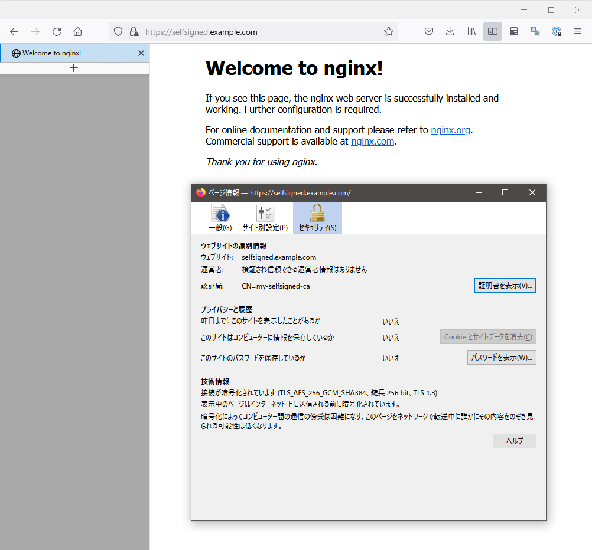

k8s の cert-manager で管理している証明書を k8s 外の マシン(WSL2) で利用してみました。

## 構成

Docker Desktop で稼働している k8s に cert-manager をインストールし自己署名証明書を作成します。  
WSL2 状に nginx をインストールしその自己署名証明書で HTTPS で Listen させます。

## ophum/k8s-secret-fs

cert-manager で管理している証明書を、k8s 外の VM で利用するためには「secret から証明書のデータを取得しコピーする」という方法が考えられます。  
しかし以下のような課題があります。

- 証明書の更新時などに再度コピーする必要がある

- 利用する VM が複数ある場合は各 VM に配布する必要がある

そこで、secret のデータをファイルとしてマウントできる[ophum/k8s-secret-fs](https://github.com/ophum/k8s-secret-fs)を実装しました。

## 使ってみる

### cert-manager のインストール

```
kubectl apply -f https://github.com/cert-manager/cert-manager/releases/download/v1.9.1/cert-manager.yaml
```

[cert-manager Kubectl apply](https://cert-manager.io/docs/installation/kubectl/)

### 自己署名証明書

#### CA の作成

```yaml
apiVersion: cert-manager.io/v1
kind: ClusterIssuer
metadata:
  name: selfsigned-issuer
spec:
  selfSigned: {}
---
apiVersion: cert-manager.io/v1
kind: Certificate
metadata:
  name: my-selfsigned-ca
spec:
  isCA: true
  commonName: my-selfsigned-ca
  secretName: root-secret
  privateKey:
    algorithm: ECDSA
    size: 256
  issuerRef:
    name: selfsigned-issuer
    kind: ClusterIssuer
    group: cert-manager.io
---
apiVersion: cert-manager.io/v1
kind: Issuer
metadata:
  name: my-ca-issuer
spec:
  ca:
    secretName: root-secret
```

[cert-manager SelfSigned](https://cert-manager.io/docs/configuration/selfsigned/)

### 自己署名証明書発行

```yaml
apiVersion: cert-manager.io/v1
kind: Certificate
metadata:
  name: selfsigned.example.com
spec:
  subject:
    organizations:
      - MyOrg
    countries:
      - Japan
    organizationalUnits:
      - MyUnit
    localities:
      - Osaka
    provinces:
      - Osaka
  commonName: selfsigned.example.com
  duration: 8760h
  dnsNames:
    - selfsigned.example.com
  secretName: selfsigned.example.com
  issuerRef:
    name: my-ca-issuer
    kind: Issuer
    group: cert-manager.io
  privateKey:
    algorithm: RSA
    size: 2048
```

`selfsigned.example.com` という名前で作成します。

apply すると以下のように証明書が作成され READY が True になります。

```bash
hum@ryzen5pc:~/cert$ kubectl get cert
NAME                     READY   SECRET                   AGE
my-selfsigned-ca         True    root-secret              117s
selfsigned.example.com   True    selfsigned.example.com   2s
```

ついでに hosts に登録しておきます

```bash
echo "127.0.0.1 selfsigned.example.com" | sudo tee -a /etc/hosts
```

## k8s-secret-fs を起動する

k8s-secret-fs のバイナリをダウンロードします。

```bash
wget https://github.com/ophum/k8s-secret-fs/releases/download/v0.2.0/k8s-secret-fs_0.2.0_linux_amd64.tar.gz -O - | tar xvz
```

設定ファイルを作成します。

```bash
cat <<EOF > config.yaml
kubeconfig: ${HOME}/.kube/config
namespace: default
secretName: selfsigned.example.com
mountPoint: /mnt/k8s-secret-fs/
EOF
```

マウントポイントを作成します。

```bash
sudo mkdir -p /mnt/k8s-secret-fs
```

起動します。

```bash
sudo ./k8s-secret-fs -config config.yaml &
```

マウントポイントを `ls` で見てみると以下のように証明書ファイルが出来ていることが分かります。

```bash
sudo ls /mnt/k8s-secret-fs
ca.crt  tls.crt  tls.key
```

## nginx で利用してみる

WSL2 上にマウントできたので、このファイルを nginx で利用してみます。

まずは nginx をインストールします。

```bash
sudo apt install nginx
```

設定ファイルを作成します。

```bash
cat <<EOF | sudo tee /etc/nginx/sites-available/ssl.conf
server {
        listen 443 ssl default_server;
        listen [::]:443 ssl default_server;

        server_name selfsigned.example.com;
        root /var/www/html;
        index index.html index.htm index.nginx-debian.html;

        ssl_certificate /mnt/k8s-secret-fs/tls.crt;
        ssl_certificate_key /mnt/k8s-secret-fs/tls.key;

        location / {
                try_files  $uri $uri/ =404;
        }
}
EOF
sudo ln -s /etc/nginx/sites-available/ssl.conf /etc/nginx/sites-enabled/ssl.conf
```

nginx を起動します。(WSL2 では systemd が動作していないため直接起動)

```bash
sudo nginx
```

## curl してみる

`https://selfsigned.example.com`に ca ファイルを指定して curl してみます。

```bash
 sudo curl https://selfsigned.example.com/ -v --cacert /mnt/k8s-secret-fs/ca.crt
*   Trying 127.0.0.1:443...
* TCP_NODELAY set
* Connected to selfsigned.example.com (127.0.0.1) port 443 (#0)
* ALPN, offering h2
* ALPN, offering http/1.1
* successfully set certificate verify locations:
*   CAfile: /mnt/k8s-secret-fs/ca.crt
  CApath: /etc/ssl/certs
* TLSv1.3 (OUT), TLS handshake, Client hello (1):
* TLSv1.3 (IN), TLS handshake, Server hello (2):
* TLSv1.3 (IN), TLS handshake, Encrypted Extensions (8):
* TLSv1.3 (IN), TLS handshake, Certificate (11):
* TLSv1.3 (IN), TLS handshake, CERT verify (15):
* TLSv1.3 (IN), TLS handshake, Finished (20):
* TLSv1.3 (OUT), TLS change cipher, Change cipher spec (1):
* TLSv1.3 (OUT), TLS handshake, Finished (20):
* SSL connection using TLSv1.3 / TLS_AES_256_GCM_SHA384
* ALPN, server accepted to use http/1.1
* Server certificate:
*  subject: C=Japan; ST=Osaka; L=Osaka; O=MyOrg; OU=MyUnit; CN=selfsigned.example.com
*  start date: Aug  6 19:52:08 2022 GMT
*  expire date: Aug  6 19:52:08 2023 GMT
*  subjectAltName: host "selfsigned.example.com" matched cert's "selfsigned.example.com"
*  issuer: CN=my-selfsigned-ca
*  SSL certificate verify ok.
> GET / HTTP/1.1
> Host: selfsigned.example.com
> User-Agent: curl/7.68.0
> Accept: */*
>
* TLSv1.3 (IN), TLS handshake, Newsession Ticket (4):
* TLSv1.3 (IN), TLS handshake, Newsession Ticket (4):
* old SSL session ID is stale, removing
* Mark bundle as not supporting multiuse
< HTTP/1.1 200 OK
< Server: nginx/1.18.0 (Ubuntu)
< Date: Sat, 06 Aug 2022 20:31:58 GMT
< Content-Type: text/html
< Content-Length: 612
< Last-Modified: Sat, 06 Aug 2022 20:25:14 GMT
< Connection: keep-alive
< ETag: "62eece2a-264"
< Accept-Ranges: bytes
<
<!DOCTYPE html>
<html>
<head>
<title>Welcome to nginx!</title>
<style>
    body {
        width: 35em;
        margin: 0 auto;
        font-family: Tahoma, Verdana, Arial, sans-serif;
    }
</style>
</head>
<body>
<h1>Welcome to nginx!</h1>
<p>If you see this page, the nginx web server is successfully installed and
working. Further configuration is required.</p>

<p>For online documentation and support please refer to
<a href="http://nginx.org/">nginx.org</a>.<br/>
Commercial support is available at
<a href="http://nginx.com/">nginx.com</a>.</p>

<p><em>Thank you for using nginx.</em></p>
</body>
</html>
* Connection #0 to host selfsigned.example.com left intact
```

Windows 側の hosts にも `selfsigned.example.com` を登録することでブラウザでも証明書が反映されていることが確認できました。



## さいごに

k8s-secret-fs を利用して cert-manager で作成した証明書を k8s 外のマシンで使うことができました。  
これにより以下の課題を解決できました。

- 証明書の更新時などに再度コピーする必要がある

- 利用する マシン が複数ある場合は各マシンに配布する必要がある

証明書更新時は、証明書を利用しているソフトウェアの再起動(or 設定の再読み込み)で対応することができます。

また、証明書を cert-manager で一元管理できるというメリットが大きいと思います。
