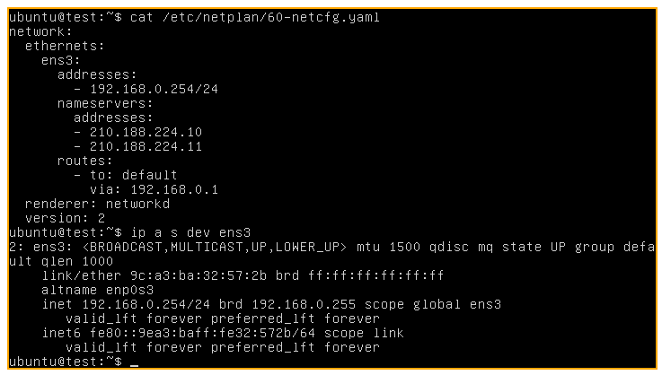
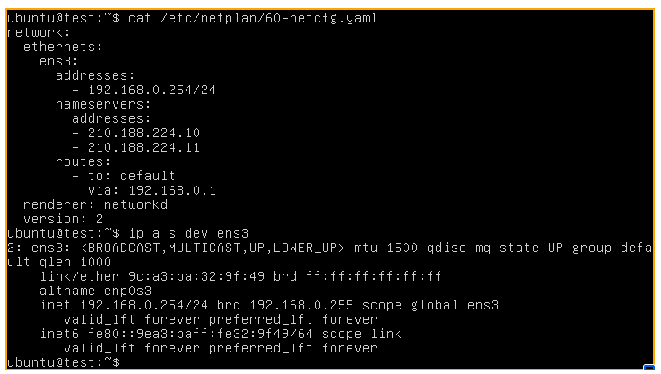
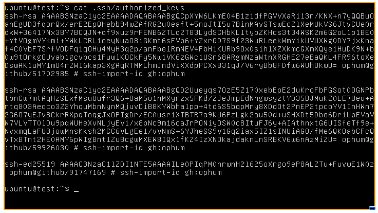
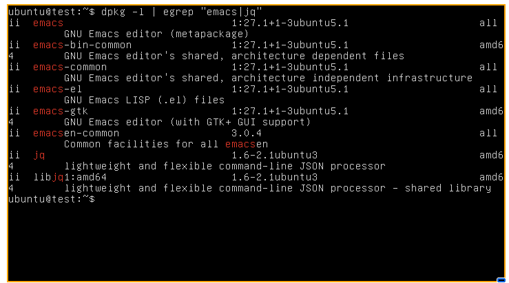

+++
title = 'さくらのクラウドのcloud-initでネットワークの設定を行う方法(2024/03)'
date = 2024-03-15T00:39:00+09:00
draft = false
+++

2024/03 時点でのさくらのクラウドの cloud-init でネットワークの設定を行う方法を記述します。

## 前提

2024/03 時点でさくらのクラウドの cloud-init では network-config を指定することができません。
利用者が指定できるのは user-data とクラウドから提供される meta-data のみとなっています。

## user-data でネットワークの設定を行う

network-config で設定できないので user-data で無理くりネットワークの設定を行います。

### write_files と runcmd を使う方法(問題あり)

以下のように、netplan の設定ファイルを write_files で設置し runcmd で netplan apply をします。

```yaml
#cloud-config
fqdn: test.local
password: $6$rounds=4096$h2xDoQtATt$AaQK928JO.RO0.9.cgyi.dAx8egj6ijfn8C1kKYOzFeXQ1o.y9HbqmWfWZmmH2JrNPP.iSbEjRP1YxO8hKy3O0
chpasswd:
  expire: false
ssh_pwauth: false
ssh_authorized_keys:
  - ssh-rsa AAAAB3NzaC1yc2EAAAADAQABAAABgQD2Uueyqs7OzE5Z170xebEpE2duKroFbPGSot0OGNPbtbnCw7mtAqHzSExfMsuUufr3Q6+8aM5o1nMXyrzx5FKd/ZJeJmpEdNhgwsyztYD35BJMukZ0LE7Ueu+Artq803Aeoco3Z2YhquMbnNynMQjuvDiB8KYWbhalpp+4td6S5bqpMry8XDdOt2PnEP2tpcoYV1InHWn72G6O7yEJvBCkrRXpqToqgJxOPIgDr/ECAusr1XTBTR7a9KU6PzLgk2au50d+uSHXDt5Dbo6DriUpEVaVW7VLVTT0lDu9pqWUHeXvNLjyEV1/x8pNc9m16oaJrPONiyOSW0c8ItuFJ6y+AIAthnxtG6UISfeTf9e+NvxmqLaFU3jowMnsKksh2KCC6VLgEel/vVNmS+6YJheSS9V1Gq2iax5IZ1sINUiAGO/fMe6QKOabCFcQvTxBTnt2HE0AMY6pWIgBntlZu8cgwMXEW8IQx1fKZ4IzXNOkajdaknLnSRBKV6w6nAzMiZU=

write_files:
  - path: /etc/netplan/60-netcfg.yaml
    owner: root:root
    permissions: 0o644
    content: |
      network:
        ethernets:
          ens3:
            addresses:
              - 192.168.0.254/24
            nameservers:
              addresses:
              - 210.188.224.10
              - 210.188.224.11
            routes:
              - to: default
                via: 192.168.0.1
        renderer: networkd
        version: 2

runcmd:
  - sudo netplan apply
```

以下のようにファイルが設置され、IP アドレスも設定されていることがわかります。



しかし、runcmd が最後に実行されるのでネットワークを利用するモジュールを使用するとエラーになって失敗してしまいます。
例えば packages や ssh-import-id など。
初期設定としてネットワークとユーザーの設定ができれば、あとは ansible でセットアップすることもできますが不便ではあります。

### bootcmd を使う方法

bootcmd で ネットワークの設定ファイルを設置します。
bootcmd のタイミングでは netplan apply が失敗します。
そこで、設定ファイルが存在しない場合(初回)は設定ファイルを設置して再起動し、
設定ファイルが存在する場合(再起動後)は何もせずに続行します。
そうすることで、

```yaml
#cloud-config
fqdn: test.local
password: $6$rounds=4096$h2xDoQtATt$AaQK928JO.RO0.9.cgyi.dAx8egj6ijfn8C1kKYOzFeXQ1o.y9HbqmWfWZmmH2JrNPP.iSbEjRP1YxO8hKy3O0
package_update: true
packages:
  - emacs
  - jq
chpasswd:
  expire: false
ssh_pwauth: false
ssh_import_id:
  - gh:ophum

bootcmd:
  - |
    if [ ! -e "/etc/netplan/60-netcfg.yaml" ]; then
    echo "network:
      ethernets:
        ens3:
          addresses:
            - 192.168.0.254/24
          nameservers:
            addresses:
            - 210.188.224.10
            - 210.188.224.11
          routes:
            - to: default
              via: 192.168.0.1
      renderer: networkd
      version: 2" | tee /etc/netplan/60-netcfg.yaml
    reboot
    fi
```

以下のように設定されます。



また、`ssh_import_id`で指定した github に登録している鍵が.ssh/authorized_keys に登録されていたり、`packages`で指定した`emacs`と`jq`がインストールされています。




## おわり

以上 2024 年 3 月時点でさくらのクラウドで可能な cloud-init でのネットワークを設定する方法でした。
