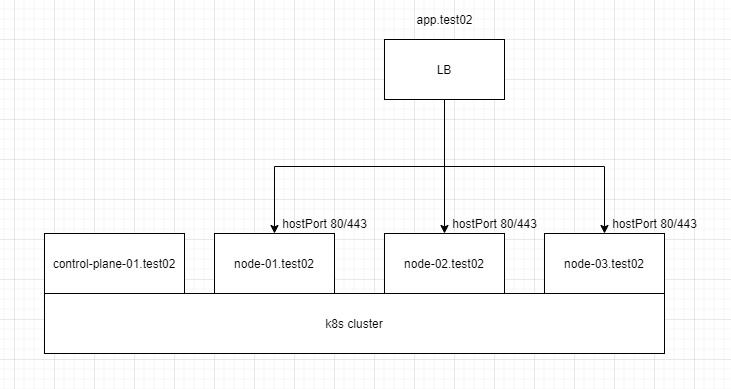
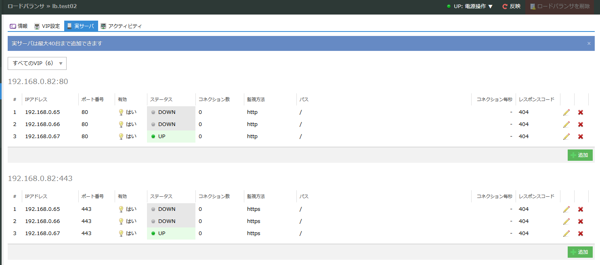
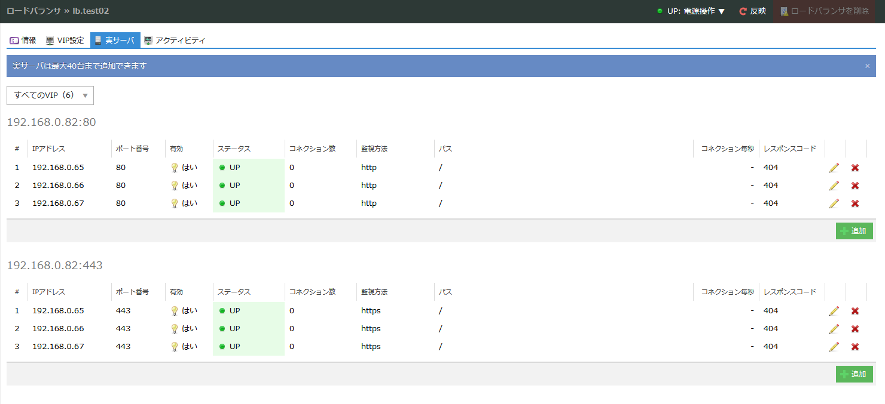
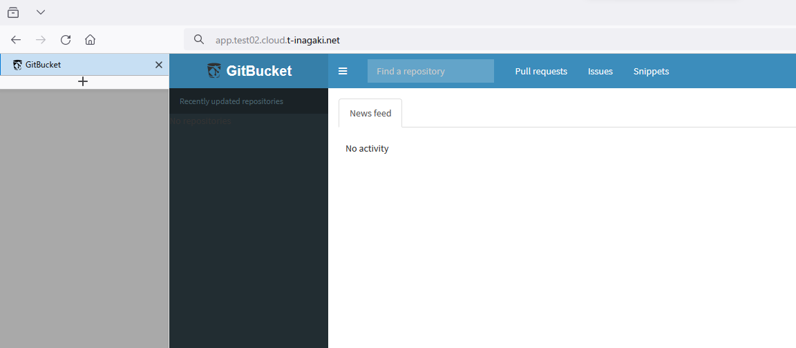

さくらのクラウドの LB アプライアンスを使って k8s の ingress controller の負荷分散を行います。

さくらのクラウドの LB アプライアンスは DSR の LB なので、VIP のポートと実サーバーのポートは同一である必要があります。
k8s では Pod の公開を行う際、大抵 Type が LoadBalancer や NodePort な Service リソースを作成し公開を行います。
Type LoadBalancer が利用できない(から LB アプライアンスを利用する)ので NodePort が選択肢に上がりますが、NodePort はデフォルトで 30000~32767 に割り当てられます。
LB アプライアンスの仕様上 80 か 443 にしたいですが、NodePort ではできません。

そこで、今回は hostPort を利用して公開することにします。
hostPort を利用することで、Pod を`ホストのIP:port`で公開できるようになります。
Pod を`ホストのIP:port`で公開するため、Pod が存在しないノードの hostPort にアクセスしても Pod にはアクセス出来ないということに注意が必要です。
今回は、LB アプライアンスのヘルスチェックで Pod が存在するノードだけで負荷分散するようにし、Deployment でデプロイするパターンと DaemonSet でデプロイするパターンを試してみます。

## 構成



- control-plane: 1 台
- node: 3 台
- ingress-controller
  - [ingress-nginx](https://github.com/kubernetes/ingress-nginx)を利用する
  - Service ではなく hostPort 80/443 で公開する

## 作業ログ

k8s のデプロイ

以下のディレクトリで作業を行います。
[ophum/kubenetes-practice-lab: ansible/](https://github.com/ophum/kubernetes-practice-lab/tree/main/ansible)

```bash
ansible-playbook -i 02-hosts --become -u ubuntu kubespray/cluster.yml
```

以降 control-plane で作業を行います。
control-plane と各 node が Ready になっていることを確認します。

```bash
root@control-plane-01:~# kubectl get node
NAME                                          STATUS   ROLES           AGE     VERSION
control-plane-01.test02.cloud.t-inagaki.net   Ready    control-plane   9m42s   v1.29.2
node-01.test02.cloud.t-inagaki.net            Ready    <none>          8m55s   v1.29.2
node-02.test02.cloud.t-inagaki.net            Ready    <none>          8m56s   v1.29.2
node-03.test02.cloud.t-inagaki.net            Ready    <none>          8m56s   v1.29.2
```

helm をインストールします。

参考: https://helm.sh/ja/docs/intro/install/

```bash
curl https://baltocdn.com/helm/signing.asc | gpg --dearmor | sudo tee /usr/share/keyrings/helm.gpg > /dev/null
sudo apt-get install apt-transport-https --yes
echo "deb [arch=$(dpkg --print-architecture) signed-by=/usr/share/keyrings/helm.gpg] https://baltocdn.com/helm/stable/debian/ all main" | sudo tee /etc/apt/sources.list.d/helm-stable-debian.list
sudo apt-get update
sudo apt-get install helm
```

helm で ingress-nginx をインストールします。

```bash
# helm upgrade --install ingress-nginx ingress-nginx \
  --repo https://kubernetes.github.io/ingress-nginx \
  --namespace ingress-nginx --create-namespace \
  --set controller.hostPort.enabled="true"
Release "ingress-nginx" does not exist. Installing it now.
NAME: ingress-nginx
LAST DEPLOYED: Fri Mar 15 17:15:19 2024
NAMESPACE: ingress-nginx
STATUS: deployed
REVISION: 1
TEST SUITE: None
NOTES:
The ingress-nginx controller has been installed.
It may take a few minutes for the load balancer IP to be available.
You can watch the status by running 'kubectl get service --namespace ingress-nginx ingress-nginx-controller --output wide --watch'
```

controller が動作していることを確認します。
node-03 で動作していることがわかります。

```bash
# kubectl get pods -n ingress-nginx -o wide
NAME                                        READY   STATUS    RESTARTS   AGE     IP               NODE                                 NOMINATED NODE   READINESS GATES
ingress-nginx-controller-6647957864-dgdn4   1/1     Running   0          2m46s   10.233.118.130   node-03.test02.cloud.t-inagaki.net   <none>           <none>
```

curl で ingress-controller にアクセスできることを確認します。

```bash
# curl node-03.test02.cloud.t-inagaki.net
<html>
<head><title>404 Not Found</title></head>
<body>
<center><h1>404 Not Found</h1></center>
<hr><center>nginx</center>
</body>
</html>
```

この時点での LB アプライアンスの実サーバーのステータスはこのようになります。



手元から VIP に curl してアクセスできることを確認します。

```bash
$ curl app.test02.cloud.t-inagaki.net
<html>
<head><title>404 Not Found</title></head>
<body>
<center><h1>404 Not Found</h1></center>
<hr><center>nginx</center>
</body>
</html>
```

今の状態では、ingress-controller が稼働しているのが node-03 の 1Pod だけになっているので、すべてのノードで Pod を動かして負荷分散できるようにします。

デフォルト設定では ingress-controller は Deployment でデプロイされます。
これを Daemonset にすることで各ノードで動かすことができます。

```bash
# helm upgrade --install ingress-nginx ingress-nginx \
  --repo https://kubernetes.github.io/ingress-nginx \
  --namespace ingress-nginx \
  --set controller.hostPort.enabled="true" \
  --set controller.kind="DaemonSet"
Release "ingress-nginx" has been upgraded. Happy Helming!
NAME: ingress-nginx
LAST DEPLOYED: Fri Mar 15 17:26:18 2024
NAMESPACE: ingress-nginx
STATUS: deployed
REVISION: 2
TEST SUITE: None
NOTES:
The ingress-nginx controller has been installed.
It may take a few minutes for the load balancer IP to be available.
You can watch the status by running 'kubectl get service --namespace ingress-nginx ingress-nginx-controller --output wide --watch'
```

各ノードで Pod が動作していることが確認できました。

```bash
# kubectl get pods -n ingress-nginx -o wide
NAME                             READY   STATUS    RESTARTS   AGE   IP               NODE                                 NOMINATED NODE   READINESS GATES
ingress-nginx-controller-tmq6q   1/1     Running   0          22s   10.233.82.131    node-01.test02.cloud.t-inagaki.net   <none>           <none>
ingress-nginx-controller-vzw2l   1/1     Running   0          22s   10.233.118.132   node-03.test02.cloud.t-inagaki.net   <none>           <none>
ingress-nginx-controller-zlt8b   1/1     Running   0          22s   10.233.103.3     node-02.test02.cloud.t-inagaki.net   <none>           <none>
```

LB アプライアンスの実サーバーの状態は以下のようになりました。



## Web アプリを動かして ingress でアクセスしてみる

Ingress リソースでアクセスできることを確認してみます。
今回は GitBucket を動かしてみます。

```yaml
apiVersion: apps/v1
kind: Deployment
metadata:
  name: gitbucket
  namespace: default
  labels:
    app: gitbucket
spec:
  replicas: 1
  selector:
    matchLabels:
      app: gitbucket
  template:
    metadata:
      labels:
        app: gitbucket
    spec:
      containers:
        - name: gitbucket
          image: ghcr.io/gitbucket/gitbucket
          command:
            - sh
            - -c
            - java -jar /opt/gitbucket.war --port=8080
          ports:
            - name: http
              containerPort: 8080
              protocol: TCP
---
apiVersion: v1
kind: Service
metadata:
  name: gitbucket
  namespace: default
  labels:
    app: gitbucket
spec:
  selector:
    app: gitbucket
  ports:
    - protocol: TCP
      port: 80
      targetPort: 8080
---
apiVersion: networking.k8s.io/v1
kind: Ingress
metadata:
  name: example
  namespace: default
  labels:
    app: gitbucket
spec:
  ingressClassName: nginx
  rules:
    - host: app.test02.cloud.t-inagaki.net
      http:
        paths:
          - path: /
            pathType: Prefix
            backend:
              service:
                name: gitbucket
                port:
                  number: 80
```

デプロイします。

```bash
# kubectl apply -f manifest.yaml
deployment.apps/gitbucket created
service/gitbucket created
ingress.networking.k8s.io/example created
```

稼働していることを確認します。

```bash
# kubectl get pods
NAME                         READY   STATUS    RESTARTS   AGE
gitbucket-57b89d5bfc-6zqk2   1/1     Running   0          46s
# kubectl get svc
NAME         TYPE        CLUSTER-IP     EXTERNAL-IP   PORT(S)   AGE
gitbucket    ClusterIP   10.233.13.13   <none>        80/TCP    7m37s
kubernetes   ClusterIP   10.233.0.1     <none>        443/TCP   59m
# kubectl get ing
NAME      CLASS   HOSTS                            ADDRESS   PORTS   AGE
example   nginx   app.test02.cloud.t-inagaki.net             80      7m39s
```

Ingress で指定したホスト名でブラウザでアクセスできることを確認します。



## おわり

以上、さくらのクラウドの LB アプライアンスで k8s の ingress controller を冗長化する方法でした。
