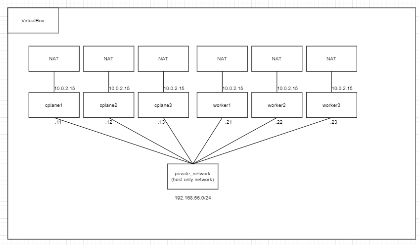

プライベート PC でも k8s の検証がしたくなったので Vagrant で仮想マシンを作成し用と思います。

k8s は control-plane 3 台, worker node 3 台の計 6 台の構成で構築します。


## Vagrantfile

```ruby
# -*- mode: ruby -*-
# vi: set ft=ruby :

Vagrant.configure("2") do |config|
  config.vm.box = "bento/ubuntu-22.04"

  (1..3).each do |id|
    config.vm.define "cplane#{id}" do |server|
      server.vm.hostname = "cplane#{id}"
      server.vm.network "private_network", ip: "192.168.56.#{10+id}"
    end
  end

  (1..3).each do |id|
    config.vm.define "worker#{id}" do |server|
      server.vm.hostname = "worker#{id}"
      server.vm.network "private_network", ip: "192.168.56.#{20+id}"
    end
  end

  config.vm.provider "virtualbox" do |vb|
    vb.cpus = 4
    vb.memory = "4096"
  end

  config.vm.provision "shell", inline: <<-SHELL
    curl https://github.com/ophum.keys >> /home/vagrant/.ssh/authorized_keys
  SHELL

end
```

### box の定義

ubuntu 22.04 を使います。

```ruby
  config.vm.box = "bento/ubuntu-22.04"
```

### サーバーの定義

each を利用して複数のサーバーを定義します。

```ruby
  (1..3).each do |id|
    config.vm.define "cplane#{id}" do |server|
      server.vm.hostname = "cplane#{id}"
      server.vm.network "private_network", ip: "192.168.56.#{10+id}"
    end
  end

  (1..3).each do |id|
    config.vm.define "worker#{id}" do |server|
      server.vm.hostname = "worker#{id}"
      server.vm.network "private_network", ip: "192.168.56.#{20+id}"
    end
  end
```

### サーバーのスペックの定義

```ruby
  config.vm.provider "virtualbox" do |vb|
    vb.cpus = 4
    vb.memory = "4096"
  end
```

### サーバー初回起動時の処理

github に登録してある公開鍵をインストールします。(ほかに方法がありそうだけどわからなかったのでこれで・・・)

```ruby
  config.vm.provision "shell", inline: <<-SHELL
    curl https://github.com/ophum.keys >> /home/vagrant/.ssh/authorized_keys
  SHELL

```

## 実行

```
> vagrant status
Current machine states:

cplane1                   not created (virtualbox)
cplane2                   not created (virtualbox)
cplane3                   not created (virtualbox)
worker1                   not created (virtualbox)
worker2                   not created (virtualbox)
worker3                   not created (virtualbox)

This environment represents multiple VMs. The VMs are all listed
above with their current state. For more information about a specific
VM, run `vagrant status NAME`.
> vagrant up
```
