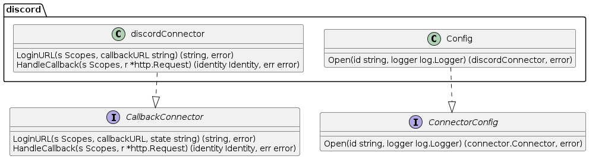
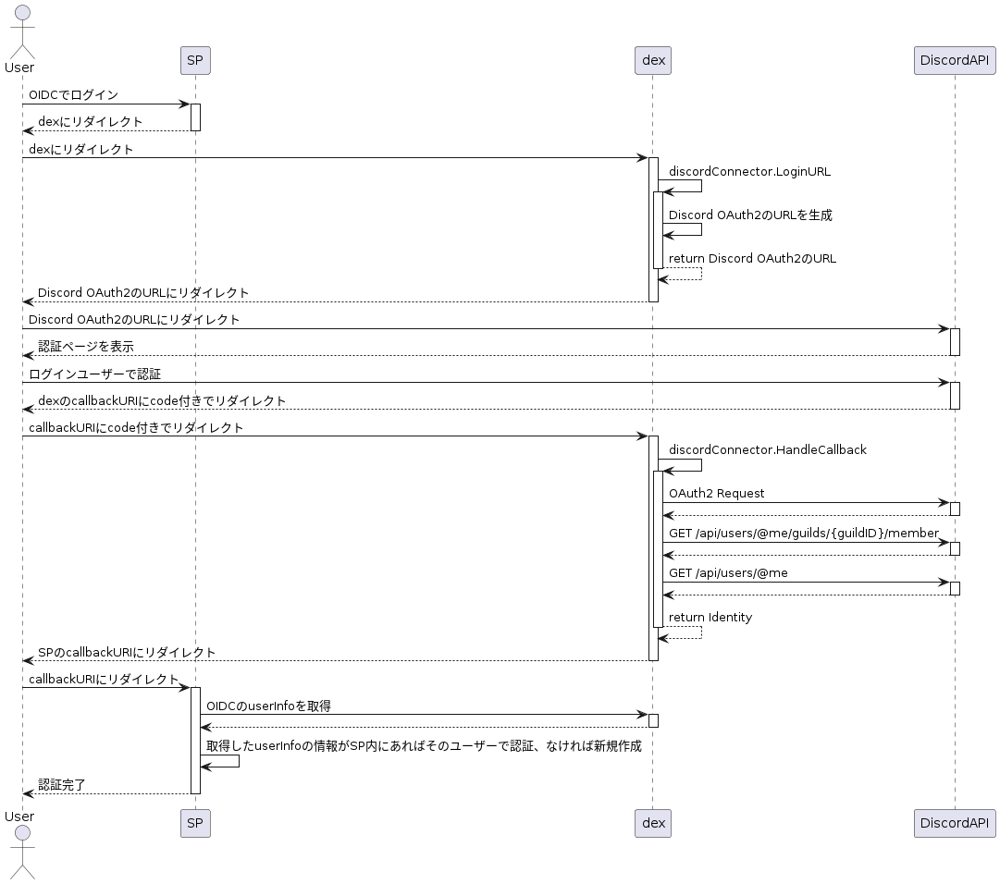

[dexidp/dex](https://github.com/dexidp/dex)を利用することで OIDC に対応していない認証サーバーで OIDC できるようになります。

dex が OIDC のリクエストを受け取り connector を介して OAuth2 や LDAP などで認証します。

## 背景

connector には主要な ID Provider が実装されていますが Discord は実装されていないため oauth connector を利用することで discord oauth2 で認証することができます。
しかし、今回は、ある Discord サーバー(API 上では guild となっていた)に所属しているメンバーだけ認可したかったので、単に oauth connector を使うだけではこの要件を満たせませんでした。

そこで、oauth2 で認証して サーバー ID をチェックする discord-connector を実装しました。

## connector の実装について

[CallbackConnector](https://github.com/dexidp/dex/blob/v2.39.1/connector/connector.go#L52) と [ConnectorConfig]() のインターフェースを実装し登録することで connector を追加できます。
CallbackConnector は Discord OAuth2 とやり取りする実装をします。
Discord OAuth2 の認証 URL を返したり
callback で認証されたら、Discord API で Guild メンバー情報やユーザー情報を取得し dex に返します。

ConnectorConfig は discordConnector の実装を返します。



この ConnectorConfig を実装した`discord.Config`を server/server.go の ConnectorsConfig に登録することで、利用できるようになります。

https://github.com/dexidp/dex/blob/v2.39.1/server/server.go#L576

```golang
var ConnectorsConfig = map[string]func() ConnectorConfig{
	"keystone":        func() ConnectorConfig { return new(keystone.Config) },
    ...
    "discord": func() ConnectorConfig { return new(discord.Config) },
}
```

実装 [https://github.com/dexidp/dex/compare/master...ophum:dex:master](https://github.com/dexidp/dex/compare/master...ophum:dex:master)

以下のように設定ファイルに記述することで利用できます。
guildID には Discord のサーバー ID を文字列で記述します。

```yaml
connectors:
  - type: discord
    id: discord
    name: discord
    config:
      clientID: "discord client id..."
      clientSecret: "discord client secret..."
      redirectURI: https://localhost/dex/callback
      guildID: ""
```

処理の流れは以下のようになってます。(適当に描いたので間違ってるとことあるかもしれないけど雰囲気)


