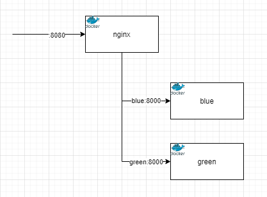
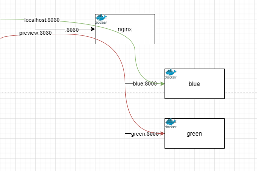
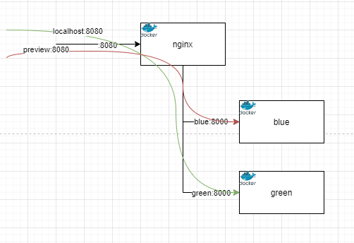

Nginx を利用して Blue/Green Deployment を試してみました。
よく k8s を利用したものなどを紹介されていることが多いですが、今回は Nginx の設定ファイルを良しなにして Blue/Green Deployment を行います。
また、切り替え時に既存の通信が正常に処理されるのかも確かめたいと思います。

[ophum/kakisute/nginx-blue-green](https://github.com/ophum/kakisute/tree/main/nginx-blue-green)

## 構成

検証環境は Docker を利用しました。

nginx と blue 用のアプリケーションと green 用のアプリケーションの 3 つのコンテナを利用します。

アプリケーションは、それぞれの環境名を返すだけの Web サーバーです。blue の場合`blue`、green の場合 `green`とレスポンスが返されます。
また、クエリパラメータで`sleep`を指定することで、レスポンスを指定時間遅らせることができます。(`http://localhost:8080/?sleep=10s` 10 秒後にレスポンスが返る)



初期状態では、blue を現行環境、green を新バージョン環境とします。
つまり、本番 URL の `localhost:8080` でアクセスすると `blue`が返り、 `preview:8080` でアクセスすると`green`が返ります。



現行から新バージョンに環境を切り替えた後は、本番 URL の `localhost:8080` でアクセスすると`green`が返り、`preview:8080` でアクセスすると`blue`が返るようになります



こうすることで、無停止で新バージョンに切り替えが可能となります。また、新バージョンに不具合がある場合も無停止で旧バージョンに切り戻しできます。
さらに新しいバージョンをデプロイするときは、今度は blue に新バージョンをデプロイし切り替えるといった具合です。

また、新バージョンに対しての入り口を用意しておけば事前確認も可能です。(Host が関わるような仕様がアプリケーションにある場合は工夫が必要ですが今回は省きます。)

## 実装

ここでは、どのように実現するかを説明します。

構成で説明した内容を実現するには、以下のような設定が必要になります。

blue が現行の場合

- blue の設定 (`blue.conf` 現行)
- green の設定 (`green-preview.conf` プレビュー)

green が現行の場合

- blue の設定 (`blue-preview.conf` プレビュー)
- green の設定 (`green-conf` 現行)

またどちらが現行によって設定ファイルを切り替える必要があります。
これらの 4 つの設定ファイルは任意の場所(今回は`/etc/nginx/sites-available`に配置)に置いておき `/etc/nginx/conf.d/`にシンボリックリンクを張ることで設定を反映させます。

つまり blue が現行の場合は以下のように設定します。

```bash
ln -s /etc/nginx/sites-available/blue.conf /etc/nginx/conf.d/blue.conf
ln -s /etc/nginx/sites-available/green-preview.conf /etc/nginx/conf.d/green-preview.conf
```

blue から green への切り替えは、`blue.conf`と`green-preview.conf`のリンクを削除し `green.conf`と`blue-preview.conf`のリンクを作成します。

設定の反映は nginx をリロードすることで行います。
今回は docker を利用しているので、nginx コマンドでリロードします。`nginx -s reload`とすることでリロードできます。
systemd を利用している場合は`systemctl reload nginx`です。

reload することで、現行に接続中の通信を途中で切断することなく新しいバージョンに切り替えられます。

ここまでの内容をスクリプトにしました。
[スクリプト: scripts/bg-change.sh](https://github.com/ophum/kakisute/blob/main/nginx-blue-green/scripts/bg-change.sh)

```bash
#!/bin/bash


CONFD=/etc/nginx/conf.d
SITES_AVAILABLE=/etc/nginx/sites-available

function change() {
    echo "$1 -> $2"
    rm $CONFD/$1.conf
    rm $CONFD/$2-preview.conf

    ln -s $SITES_AVAILABLE/$2.conf $CONFD/$2.conf
    ln -s $SITES_AVAILABLE/$1-preview.conf $CONFD/$1-preview.conf

    nginx -s reload
}

current=$(bash /etc/nginx/scripts/bg-current.sh)
if [ $current == "blue" ]; then
    change blue green
else
    change green blue
fi
```

## 実行ログ

```bash
$ git clone https://github.com/ophum/kakisute.git
$ cd kakisute/nginx-blue-green/
$ docker compose up -d
```

この時点では設定ファイルが nginx の初期のものになっているので、初期ページが表示されます。

```bash
$ curl localhost:8080
<!DOCTYPE html>
<html>
...
```

`default.conf` を削除し `blue.conf` と `green-preview.conf` を設置するスクリプトを実行します。

```
$ docker compose exec --workdir /etc/nginx/scripts/ nginx bash bg-init.sh
2024/07/18 19:15:46 [notice] 42#42: signal process started
```

`curl-release.sh` で`blue`、 `curl-preview.sh` で`green`が表示されることを確認します。

```
$ bash ./curl-release.sh
blue
$ bash ./curl-preview.sh
green
```

それぞれスクリプトの内容は以下のようになっています。

```bash
$ cat ./curl-release.sh
#!/bin/bash

DURATION=${1-0s}
curl localhost:8080/?sleep=$DURATION

echo

$ cat ./curl-preview.sh
#!/bin/bash

DURATION=${1-0s}
curl -H "Host: preview" localhost:8080/?sleep=$DURATION

echo
```

次に、blue と green を切り替えてみます。

```bash
$ docker compose exec --workdir /etc/nginx/scripts/ nginx bash bg-change.sh
blue -> green
2024/07/18 19:18:26 [notice] 58#58: signal process started
```

`curl-release.sh` で`green`, `curel-preview.sh` で`blue`が表示されることを確認します。

```bash
$ bash ./curl-release.sh
green
$ bash ./curl-preview.sh
blue
```

うまく切り替わっていることが確認できました。

## 切り替え時に既存の通信が正常に処理されるか

blue から green に切り替える際、blue に接続していた通信はそのまま正常に処理され、切り替え後のリクエストは green で処理されるか検証します。

今回利用したアプリケーションではレスポンスまでの時間を遅らせることができるので、blue の時点で 10 秒遅延するリクエストを送り、10 秒以内に切り替え、10 秒後に blue のレスポンスが返ってくることを確認します。
また、切り替え後のリクエストは green の内容が返ることを確認します。

blue が現行の状態で行う。

```bash
$ docker compose exec --workdir /etc/nginx/scripts/ nginx bash bg-current.sh
blue
```

10 秒遅延で`curl-release.sh`を実行。10 秒間待ち状態になります。

```bash
$ bash ./curl-release.sh 10s

```

待ち状態の間別のターミナルで切り替えます。
この時、`curl-release.sh` を遅延なしで実行して green に切り替わっていることを確認します。

```bash
$ docker compose exec --workdir /etc/nginx/scripts/ nginx bash bg-change.sh
2024/07/18 19:25:32 [notice] 95#95: signal process started
$ bash ./curl-release.sh
green
```

10 秒経過後、blue が返ることを確認します。

```bash
$ bash ./curl-release.sh 10s
blue
```

以上で、blue と green を無停止で切り替えることができ、切り替え前の通信は切断されずに処理が行われることがわかりました。
