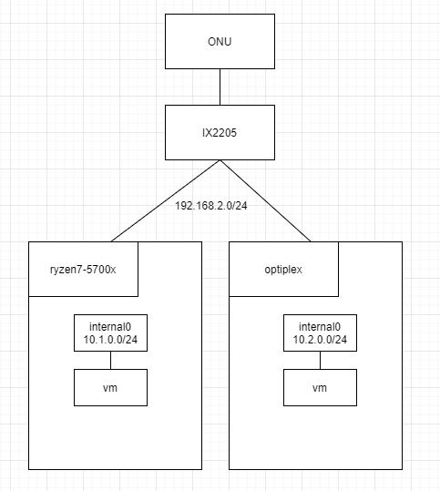
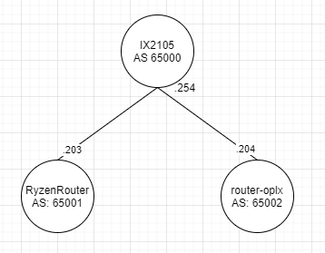

現在自宅サーバーが 2 台あります。
Optiplex という DELL のデスクトップ PC と Ryzen7 5700X で構築した自作 PC です。

これらのサーバーでは仮想マシンやコンテナを稼働させます。
各サーバー内にそれぞれ仮想ネットワークを作成しサブネットを分けて管理しています。
vm がインターネットと通信する際はデフォルトルートを IX2205 のほうに流せばよいですが、ryzen7-5700x の vm と optiplex の vm が通信するにはルート情報を設定する必要があります。


以前までは Optiplex しかなかったのでスタティックルーティングで対応していましたが、サーバーが増えたことで各サーバー間でのルーティング情報の設定をダイナミックに行いたいと考えました。

今回は各サーバー・ルーターをデータセンターに見立ててそれぞれにプライベート AS を割り当てて BGP を行ってみることにしました。
(どちらかというと Clos network のほうに近い?)

構成は以下のようになります。

| 機器                       | IP               | Private AS | 説明                                                                       |
| -------------------------- | ---------------- | ---------- | -------------------------------------------------------------------------- |
| IX2105                     | 192.168.2.254/24 | 65000      | PPPoE でインターネットと接続しています。                                   |
| RyzenRouter (ryzen7-5700x) | 192.168.2.203/24 | 65001      | ryzen7-5700x サーバー上で動かすルーター。LXC コンテナで FRR を稼働します。 |
| router-oplx (optiplex)     | 192.168.2.204/24 | 65002      | optiplex サーバー上で動かすルーター。LXC コンテナで FRR を稼働します。     |



RyzenRouter や router-oplx は LXC コンテナに FRR を入れてルーターとして稼働させます。
コンテナの NIC の設定で、ホストの NIC を親とした MACVLAN で接続します。
これによりホストの NIC がつながっているサブネットに別 MAC アドレスで接続できます。

lxc profile の例

```yaml
devices:
  eth0:
    name: eth0
    nictype: macvlan
    parent: enp7s0
    type: nic
```

機器の都合上、IX と各サーバーの接続は IX の SW で行うため IX と各ルーターの IP アドレスは/24 のサブネットになっています。
(/32 にしてスタティックルート書いてもいいなと思いつつ)

## frr のインストール

コンテナは ubuntu:22.04 を利用しています。

```
# apt update
# apt install frr
```

### BGP を使えるようにする

`/etc/frr/daemons`の`bgpd=no`を`bgpd=yes`に変更し frr を再起動します。

```
# systemctl restart frr
```

## 各機器の BGP 設定

各機器の BGP 設定を抜粋します。

### IX2105

IX2105 は RyzenRouter と optiplex がネイバーになります。
デフォルトルートを広報したいので `originate-default`を設定しています。

```
router bgp 65000
  router-id 192.168.2.254
  neighbor 192.168.2.203 remote-as 65001
  neighbor 192.168.2.204 remote-as 65002
  address-family ipv4 unicast
    originate-default
```

### RyzenRouter

RyzenRouter は IX2105 がネイバーになります。

frr はデフォルトでは広報するネットワークや、受け取るネットワークのアクセスリストを設定する必要があります。
今回は、自身が持つ`10.1.0.0/24`のネットワークの広報を許可、ネイバーからは全て受け取る設定にしています。
この辺りはいまいち分かっていない・・・

```
router bgp 65001
 bgp router-id 192.168.2.203
 neighbor 192.168.2.254 remote-as 65000
 !
 address-family ipv4 unicast
  network 10.1.0.0/24
  neighbor 192.168.2.254 prefix-list allowed-in in
  neighbor 192.168.2.254 prefix-list allowed-adv out
 exit-address-family
exit
!
ip prefix-list allowed-adv seq 5 permit 10.1.0.0/24
ip prefix-list allowed-adv seq 10 deny any
ip prefix-list allowed-in seq 5 permit any
```

### router-oplx

RyzenRouter とほぼ同じで広報するネットワークが`10.2.0.0/24`となります。

```
router bgp 65002
 neighbor 192.168.2.254 remote-as 65000
 !
 address-family ipv4 unicast
  network 10.2.0.0/24
  neighbor 192.168.2.254 prefix-list allowed-in in
  neighbor 192.168.2.254 prefix-list allowed-adv out
 exit-address-family
exit
!
ip prefix-list allowed-adv seq 5 permit 10.2.0.0/24
ip prefix-list allowed-adv seq 10 deny any
ip prefix-list allowed-in seq 5 permit any
```

## 各機器のルーティングテーブル

### IX2105

BGP で 10.1.0.0/24 と 10.2.0.0/24 のルート情報を受け取っていることがわかります。

```
Router(config)# sh ip route bgp
IP Routing Table - 2 entries, 6 hidden, 2040 frees
Entries: 0 Connected, 0 Static, 0 RIP, 0 OSPF, 2 BGP
Codes: C - Connected, S - Static, R - RIP, O - OSPF, IA - OSPF inter area
       N1 - OSPF NSSA external type 1, N2 - OSPF NSSA external type 2
       E1 - OSPF external type 1, E2 - OSPF external type 2, B - BGP
       * - Candidate default, s - Summary
Timers: Age
B      10.1.0.0/24 [20/0] via 192.168.2.203, GigaEthernet1:1.0, 5d5h10m6s
B      10.2.0.0/24 [20/0] via 192.168.2.204, GigaEthernet1:1.0, 5d5h7m15s
```

### RyzenRouter

BGP でデフォルトルートと Optiplex 側のネットワーク `10.2.0.0/24`へのルート情報を受け取っていることがわかります。

ネイバーになっているのは IX だけですが、IP アドレスが/24 で設定していて同じサブネットになっているからか`10.2.0.0/24`のネットワークは `B>* 10.2.0.0/24 [20/0] via 192.168.2.204`と直接 router-oplx のほうが next hop になっています。

```
RyzenRouter# sh ip route bgp
Codes: K - kernel route, C - connected, S - static, R - RIP,
       O - OSPF, I - IS-IS, B - BGP, E - EIGRP, N - NHRP,
       T - Table, v - VNC, V - VNC-Direct, A - Babel, F - PBR,
       f - OpenFabric,
       > - selected route, * - FIB route, q - queued, r - rejected, b - backup
       t - trapped, o - offload failure

B   0.0.0.0/0 [20/1] via 192.168.2.254, eth0, weight 1, 01:26:54
B>* 10.2.0.0/24 [20/0] via 192.168.2.204, eth0, weight 1, 5d05h08m
```

こちらは allied-telesis の CentreCOM のドキュメントからの引用になりますが、最適ルートとして登録されたものを FIB とよぶようです。実際上記のルート情報は `B>*`で FIB route となってることがわかりました。

> FIB（Forwarding Information Base：IP 転送表）は、IP パケットの転送判断時に参照するデータベースです。FIB には、RIB に登録されている経路のうち、「最適」と判断されたもの、すなわち、実際にパケット転送に使用される経路だけが登録されます。最適と判断する基準は次に述べる管理距離です。

[IP ルーティング/経路制御](https://www.allied-telesis.co.jp/support/list/switch/x900_sb900/doc/v532_docs/overview-3.html)

### router-oplx

こちらも RyzenRouter と同じようにルート情報が登録されていることがわかります。

```
router-oplx# sh ip route bgp
Codes: K - kernel route, C - connected, S - static, R - RIP,
       O - OSPF, I - IS-IS, B - BGP, E - EIGRP, N - NHRP,
       T - Table, v - VNC, V - VNC-Direct, A - Babel, F - PBR,
       f - OpenFabric,
       > - selected route, * - FIB route, q - queued, r - rejected, b - backup
       t - trapped, o - offload failure

B   0.0.0.0/0 [20/1] via 192.168.2.254, eth0, weight 1, 00:37:36
B>* 10.1.0.0/24 [20/0] via 192.168.2.203, eth0, weight 1, 00:37:36
```

## さいごに

このネットワークにより、各サーバー上の仮想マシンやコンテナ同士で通信が行えるようになりました。

また、BGP についての理解が少し深まったと思います。(まだまだ何もわかっていないけれど・・・)
