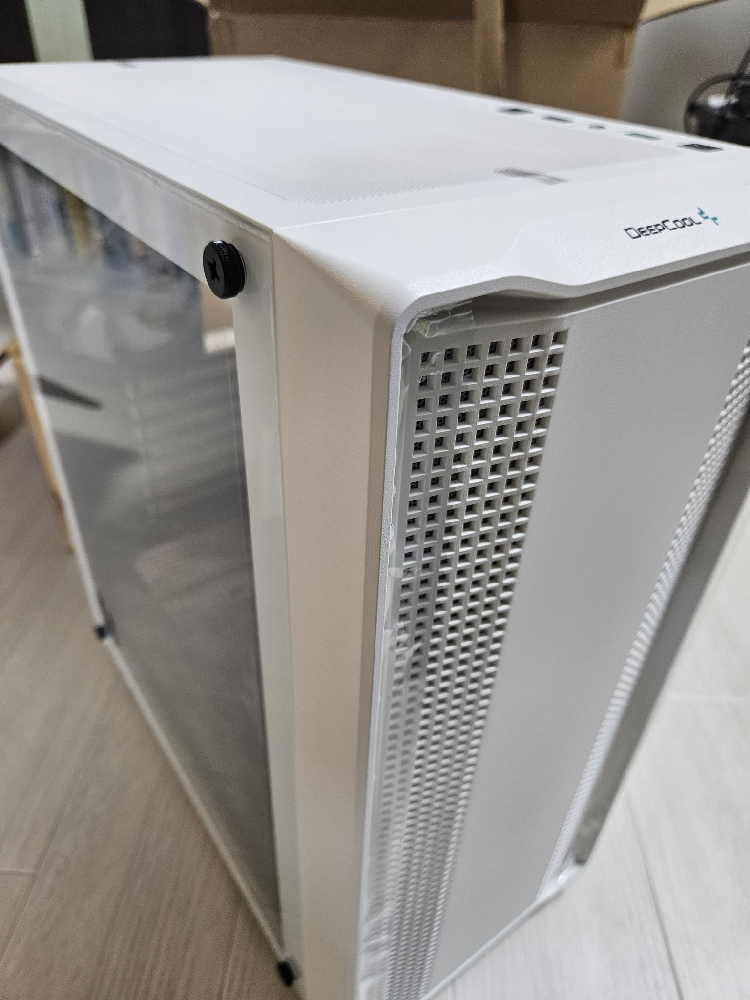

最近、Ryzen7 5700X が安いタイミングがありましたので安めのパーツで PC を組んで自宅サーバーにしてみました。


構成としては以下の通りです。
2024 年 8 月 28 日時点でのドスパラでの値段です。2，3 日後に商品ページを見に行ったら CPU が 1 万円ほど値上がりしていました。ﾗｯｷｰ
| パーツ | 値段 |
| --------------------------------------------------------------------------------------- | --------------- |
| CPU Ryzen7 5700X | 22,580 円 |
| CPU クーラー 虎徹 MARK3 | 3,550 円 |
| M/B ASUS PRIME A520M-A Ⅱ | 7,980 円 |
| MEM CFD W4U3200CS-16G (16GB×2) | 8,180 円 |
| SSD Crucial P3 CT1000P3SSD8JP (M.2 2280 1TB) | 9,450 円 |
| 電源 DEEPCOOL PK450D (450W) | 4,980 円 |
| ケース DEEPCOOL CC560 WH V2 R-CC560-WHGAA4-G-2 (ATX ガラス ホワイト) ドスパラ限定モデル | 6,980 円 |
| | 合計: 63,700 円 |

OS は Ubuntu Server を使います。
また、グラボは家に余ってるモノを利用しました。

グラボはもともと自宅サーバーとして利用していた Optiplex というデスクトップ PC に挿していたものを利用しようと考えていましたが、ロープロファイルのグラボのため今回購入した PC ケースにははまりませんでした。(汗)

もともとグラボは一時的に挿してセットアップだけしようと考えていたので、セットアップの間だけマザボをケースから外した状態でグラボを接続することで対応しました。


## CPU について

CPU は Ryzen 7 5700X で 8 コア 16 スレッドあり強力です。サーバー用途ですからあまりケース内も熱くならないと踏んで空冷としました。

実際にコアの温度が、通常時 30 度ほど、UnixBench 実行時が一時的に 60 度ほどになりました。
常に CPU を 100％稼働させるわけでもないので十分かと思いました。(実際はどうか分からないですが)

※ 通常時と書いてますが、まっさらな状態で実行ではなく、仮想マシンやコンテナが別で起動している状態で行っています。。。

## メモリについて

メモリは 16GB2 枚で 32GB あります。マザーボードでは 4 枚メモリを挿せるので、あと 2 枚 16GB を追加すれば合計 64GB に拡張できる余地があります。M/B 的には 32GB4 枚で 128GB 可能なようですが予算の都合上 16GB2 枚で組むことになりました。

このサーバーは仮想マシンを動かすホストとして使います。
そのため、メモリは多いに越したことはないですが、CPU が 8 コア 16 スレッドという都合上そんなに多くの仮想マシンを稼働させられないと思うと 64GB で十分なのかもしれません。

2 コア 8GB の仮想マシンを 6，7 台動かせたら十分です。(CPU はオーバーコミットして 4 コア割り当ててもいいかもしれない)

すでに 32GB では足りないなとはなってますので 64GB にしていきたいところではあります。

## ケースについて

ケースは DEEPCOOL のドスパラ限定モデルで白色のものを選んでみました。

僕が使ってるメイン PC よりかっこいい・・・。

このケースの良いところは、まず安いです。
7000 円で白色で側面がガラスのケースはこれ以外になかったです。(安いといってもケースとしては普通の値段？)

次に、前面ファンが 3 個ついている点です。
大抵は背面に 1 つだったり前面にあっても 1 つだったりするのではないでしょうか。
3 個ついてるのは安く抑えたいけど、エアフロー的にはファンを付けておきたいという今回のニーズにぴったりでした。



## 電源について

電源には DEEPCOOL の DEEPCOOL PK450D R-PK450D-FA0B-JP (450W) を選びました。
安かったからです。

グラボはないので 450W と小さいものを選んでいます。
また常時稼働のサーバーですが、高負荷な稼働させるわけでもないので 80PLUS は Bronze でコストを抑えるほうを優先しました。

## UnixBench 結果

今回はスコアをとるというより温度を測りたかったので LXC コンテナ上で実行しました。

UnixBench 中の温度推移。
前半の 00:40 くらいまではシングルコア、以降はマルチコアでベンチされているっぽい。




```
   #    #  #    #  #  #    #          #####   ######  #    #   ####   #    #
   #    #  ##   #  #   #  #           #    #  #       ##   #  #    #  #    #
   #    #  # #  #  #    ##            #####   #####   # #  #  #       ######
   #    #  #  # #  #    ##            #    #  #       #  # #  #       #    #
   #    #  #   ##  #   #  #           #    #  #       #   ##  #    #  #    #
    ####   #    #  #  #    #          #####   ######  #    #   ####   #    #

   Version 5.1.3                      Based on the Byte Magazine Unix Benchmark

   Multi-CPU version                  Version 5 revisions by Ian Smith,
                                      Sunnyvale, CA, USA
   January 13, 2011                   johantheghost at yahoo period com

------------------------------------------------------------------------------
   Use directories for:
      * File I/O tests (named fs***) = /root/byte-unixbench/UnixBench/tmp
      * Results                      = /root/byte-unixbench/UnixBench/results
------------------------------------------------------------------------------


1 x Dhrystone 2 using register variables  1 2 3 4 5 6 7 8 9 10

1 x Double-Precision Whetstone  1 2 3 4 5 6 7 8 9 10

1 x Execl Throughput  1 2 3

1 x File Copy 1024 bufsize 2000 maxblocks  1 2 3

1 x File Copy 256 bufsize 500 maxblocks  1 2 3

1 x File Copy 4096 bufsize 8000 maxblocks  1 2 3

1 x Pipe Throughput  1 2 3 4 5 6 7 8 9 10

1 x Pipe-based Context Switching  1 2 3 4 5 6 7 8 9 10

1 x Process Creation  1 2 3

1 x System Call Overhead  1 2 3 4 5 6 7 8 9 10

1 x Shell Scripts (1 concurrent)  1 2 3

1 x Shell Scripts (8 concurrent)  1 2 3

16 x Dhrystone 2 using register variables  1 2 3 4 5 6 7 8 9 10

16 x Double-Precision Whetstone  1 2 3 4 5 6 7 8 9 10

16 x Execl Throughput  1 2 3

16 x File Copy 1024 bufsize 2000 maxblocks  1 2 3

16 x File Copy 256 bufsize 500 maxblocks  1 2 3

16 x File Copy 4096 bufsize 8000 maxblocks  1 2 3

16 x Pipe Throughput  1 2 3 4 5 6 7 8 9 10

16 x Pipe-based Context Switching  1 2 3 4 5 6 7 8 9 10

16 x Process Creation  1 2 3

16 x System Call Overhead  1 2 3 4 5 6 7 8 9 10

16 x Shell Scripts (1 concurrent)  1 2 3

16 x Shell Scripts (8 concurrent)  1 2 3

========================================================================
   BYTE UNIX Benchmarks (Version 5.1.3)

   System: unixbench: GNU/Linux
   OS: GNU/Linux -- 6.8.0-31-generic -- #31-Ubuntu SMP PREEMPT_DYNAMIC Sat Apr 20 00:40:06 UTC 2024
   Machine: x86_64 (x86_64)
   Language: en_US.utf8 (charmap="UTF-8", collate="UTF-8")
   CPU 0: AMD Ryzen 7 5700X 8-Core Processor (6787.8 bogomips)
          Hyper-Threading, x86-64, MMX, AMD MMX, Physical Address Ext, SYSENTER/SYSEXIT, AMD virtualization, SYSCALL/SYSRET
   CPU 1: AMD Ryzen 7 5700X 8-Core Processor (6787.8 bogomips)
          Hyper-Threading, x86-64, MMX, AMD MMX, Physical Address Ext, SYSENTER/SYSEXIT, AMD virtualization, SYSCALL/SYSRET
   CPU 2: AMD Ryzen 7 5700X 8-Core Processor (6787.8 bogomips)
          Hyper-Threading, x86-64, MMX, AMD MMX, Physical Address Ext, SYSENTER/SYSEXIT, AMD virtualization, SYSCALL/SYSRET
   CPU 3: AMD Ryzen 7 5700X 8-Core Processor (6787.8 bogomips)
          Hyper-Threading, x86-64, MMX, AMD MMX, Physical Address Ext, SYSENTER/SYSEXIT, AMD virtualization, SYSCALL/SYSRET
   CPU 4: AMD Ryzen 7 5700X 8-Core Processor (6787.8 bogomips)
          Hyper-Threading, x86-64, MMX, AMD MMX, Physical Address Ext, SYSENTER/SYSEXIT, AMD virtualization, SYSCALL/SYSRET
   CPU 5: AMD Ryzen 7 5700X 8-Core Processor (6787.8 bogomips)
          Hyper-Threading, x86-64, MMX, AMD MMX, Physical Address Ext, SYSENTER/SYSEXIT, AMD virtualization, SYSCALL/SYSRET
   CPU 6: AMD Ryzen 7 5700X 8-Core Processor (6787.8 bogomips)
          Hyper-Threading, x86-64, MMX, AMD MMX, Physical Address Ext, SYSENTER/SYSEXIT, AMD virtualization, SYSCALL/SYSRET
   CPU 7: AMD Ryzen 7 5700X 8-Core Processor (6787.8 bogomips)
          Hyper-Threading, x86-64, MMX, AMD MMX, Physical Address Ext, SYSENTER/SYSEXIT, AMD virtualization, SYSCALL/SYSRET
   CPU 8: AMD Ryzen 7 5700X 8-Core Processor (6787.8 bogomips)
          Hyper-Threading, x86-64, MMX, AMD MMX, Physical Address Ext, SYSENTER/SYSEXIT, AMD virtualization, SYSCALL/SYSRET
   CPU 9: AMD Ryzen 7 5700X 8-Core Processor (6787.8 bogomips)
          Hyper-Threading, x86-64, MMX, AMD MMX, Physical Address Ext, SYSENTER/SYSEXIT, AMD virtualization, SYSCALL/SYSRET
   CPU 10: AMD Ryzen 7 5700X 8-Core Processor (6787.8 bogomips)
          Hyper-Threading, x86-64, MMX, AMD MMX, Physical Address Ext, SYSENTER/SYSEXIT, AMD virtualization, SYSCALL/SYSRET
   CPU 11: AMD Ryzen 7 5700X 8-Core Processor (6787.8 bogomips)
          Hyper-Threading, x86-64, MMX, AMD MMX, Physical Address Ext, SYSENTER/SYSEXIT, AMD virtualization, SYSCALL/SYSRET
   CPU 12: AMD Ryzen 7 5700X 8-Core Processor (6787.8 bogomips)
          Hyper-Threading, x86-64, MMX, AMD MMX, Physical Address Ext, SYSENTER/SYSEXIT, AMD virtualization, SYSCALL/SYSRET
   CPU 13: AMD Ryzen 7 5700X 8-Core Processor (6787.8 bogomips)
          Hyper-Threading, x86-64, MMX, AMD MMX, Physical Address Ext, SYSENTER/SYSEXIT, AMD virtualization, SYSCALL/SYSRET
   CPU 14: AMD Ryzen 7 5700X 8-Core Processor (6787.8 bogomips)
          Hyper-Threading, x86-64, MMX, AMD MMX, Physical Address Ext, SYSENTER/SYSEXIT, AMD virtualization, SYSCALL/SYSRET
   CPU 15: AMD Ryzen 7 5700X 8-Core Processor (6787.8 bogomips)
          Hyper-Threading, x86-64, MMX, AMD MMX, Physical Address Ext, SYSENTER/SYSEXIT, AMD virtualization, SYSCALL/SYSRET
   15:08:30 up 1 min,  0 users,  load average: 2.60, 2.51, 2.50; runlevel 2024-09-07

------------------------------------------------------------------------
Benchmark Run: Sat Sep 07 2024 15:08:30 - 15:46:16
16 CPUs in system; running 1 parallel copy of tests

Dhrystone 2 using register variables       60211443.0 lps   (10.0 s, 7 samples)
Double-Precision Whetstone                    10559.2 MWIPS (9.9 s, 7 samples)
Execl Throughput                               3166.2 lps   (29.9 s, 2 samples)
File Copy 1024 bufsize 2000 maxblocks         80349.4 KBps  (30.0 s, 2 samples)
File Copy 256 bufsize 500 maxblocks           19756.0 KBps  (30.0 s, 2 samples)
File Copy 4096 bufsize 8000 maxblocks        311367.3 KBps  (30.0 s, 2 samples)
Pipe Throughput                             1257968.1 lps   (10.0 s, 7 samples)
Pipe-based Context Switching                 128149.2 lps   (10.0 s, 7 samples)
Process Creation                               7834.0 lps   (30.0 s, 2 samples)
Shell Scripts (1 concurrent)                  11992.8 lpm   (60.0 s, 2 samples)
Shell Scripts (8 concurrent)                   7957.6 lpm   (60.0 s, 2 samples)
System Call Overhead                        1122685.2 lps   (10.0 s, 7 samples)

System Benchmarks Index Values               BASELINE       RESULT    INDEX
Dhrystone 2 using register variables         116700.0   60211443.0   5159.5
Double-Precision Whetstone                       55.0      10559.2   1919.9
Execl Throughput                                 43.0       3166.2    736.3
File Copy 1024 bufsize 2000 maxblocks          3960.0      80349.4    202.9
File Copy 256 bufsize 500 maxblocks            1655.0      19756.0    119.4
File Copy 4096 bufsize 8000 maxblocks          5800.0     311367.3    536.8
Pipe Throughput                               12440.0    1257968.1   1011.2
Pipe-based Context Switching                   4000.0     128149.2    320.4
Process Creation                                126.0       7834.0    621.7
Shell Scripts (1 concurrent)                     42.4      11992.8   2828.5
Shell Scripts (8 concurrent)                      6.0       7957.6  13262.6
System Call Overhead                          15000.0    1122685.2    748.5
                                                                   ========
System Benchmarks Index Score                                         949.4

------------------------------------------------------------------------
Benchmark Run: Sat Sep 07 2024 15:46:16 - 16:25:41
16 CPUs in system; running 16 parallel copies of tests

Dhrystone 2 using register variables      536015112.5 lps   (10.0 s, 7 samples)
Double-Precision Whetstone                   132828.3 MWIPS (9.7 s, 7 samples)
Execl Throughput                              29218.4 lps   (29.3 s, 2 samples)
File Copy 1024 bufsize 2000 maxblocks        788209.6 KBps  (30.0 s, 2 samples)
File Copy 256 bufsize 500 maxblocks          202080.0 KBps  (30.0 s, 2 samples)
File Copy 4096 bufsize 8000 maxblocks       2936963.0 KBps  (30.0 s, 2 samples)
Pipe Throughput                            13868382.0 lps   (10.0 s, 7 samples)
Pipe-based Context Switching                1164268.7 lps   (10.0 s, 7 samples)
Process Creation                              69454.5 lps   (30.0 s, 2 samples)
Shell Scripts (1 concurrent)                  81457.2 lpm   (60.0 s, 2 samples)
Shell Scripts (8 concurrent)                  10194.2 lpm   (60.0 s, 2 samples)
System Call Overhead                       12917827.2 lps   (10.0 s, 7 samples)

System Benchmarks Index Values               BASELINE       RESULT    INDEX
Dhrystone 2 using register variables         116700.0  536015112.5  45931.0
Double-Precision Whetstone                       55.0     132828.3  24150.6
Execl Throughput                                 43.0      29218.4   6795.0
File Copy 1024 bufsize 2000 maxblocks          3960.0     788209.6   1990.4
File Copy 256 bufsize 500 maxblocks            1655.0     202080.0   1221.0
File Copy 4096 bufsize 8000 maxblocks          5800.0    2936963.0   5063.7
Pipe Throughput                               12440.0   13868382.0  11148.2
Pipe-based Context Switching                   4000.0    1164268.7   2910.7
Process Creation                                126.0      69454.5   5512.3
Shell Scripts (1 concurrent)                     42.4      81457.2  19211.6
Shell Scripts (8 concurrent)                      6.0      10194.2  16990.4
System Call Overhead                          15000.0   12917827.2   8611.9
                                                                   ========
System Benchmarks Index Score                                        7745.7
```



## さいごに

今回 65000 円ほどで自宅サーバーを組むことができました。
最小限のパーツにとどまっているのでまだまだスペックアップの余地がありますが、ゆっくりと育てていきたいところです。(HDD とか SSD 追加したい・・・！)


(写真では電源のケーブルが前面ファンの最下段に干渉してファンが止まってますが、現在は干渉しないように対処済みです w)
