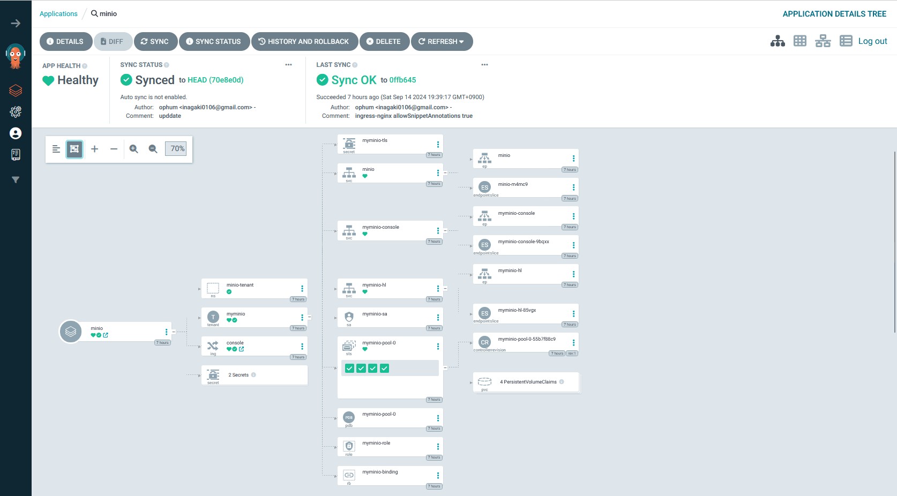
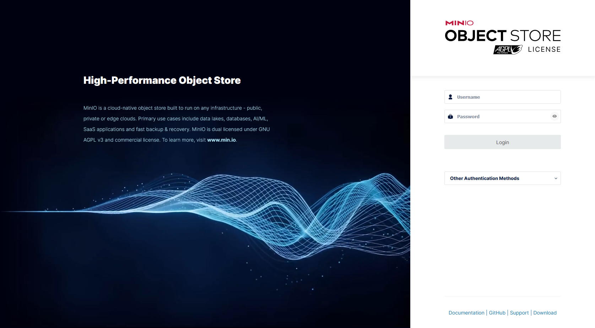

## minio operator をインストールする

ArgoCD で helm chart からインストールします。

```yaml
apiVersion: argoproj.io/v1alpha1
kind: Application
metadata:
  name: minio-operator
  namespace: argocd
spec:
  syncPolicy:
    syncOptions:
      - CreateNamespace=true
  project: default
  source:
    chart: operator
    repoURL: https://operator.min.io
    targetRevision: 6.0.3
    helm:
      releaseName: operator

  destination:
    server: https://kubernetes.default.svc
    namespace: minio-operator
```

## minio をインストールする

kustomize を利用してインストールします。
以下のような`kustomization.yaml`を記述し ArgoCD の Application に登録しています。

```yaml
resources:
  - https://github.com/minio/operator/examples/kustomization/base/
  - console-ingress.yaml

patches:
  - target:
      kind: Tenant
      name: myminio
    patch: |
      - op: replace
        path: /spec/pools/0/servers
        value: 4
      - op: replace
        path: /spec/pools/0/volumesPerServer
        value: 1
      - op: replace
        path: /spec/pools/0/volumeClaimTemplate/spec/resources/requests/storage
        value: 5Gi
      - op: replace
        path: /spec/pools/0/volumeClaimTemplate/spec/storageClassName
        value: longhorn
```

patches で`kind: Tenant`の設定内容を変更しています。

`/spec/pools/0/servers`はサーバーの数を定義します。4 以上を指定する必要があります。

`/spec/pools/0/volumesPerServer`は 1 サーバー当たりのボリュームの数を指定します。

`/spec/pools/0/volumes/0/volumeClaimTemplate/spec/resources/requests/storage`はボリュームのサイズを指定します。初期値は 1Ti となっているため、ストレージの容量に合わせて変更する必要があります。

`/spec/pools/0/volumeClaimTemplate/spec/storageClassName`はストレージクラスを指定します。今回の環境では longhorn を利用しているため、`longhorn`を指定します。

## console-ingress.yaml

WebUI にアクセスできるように Ingress を追加します。

```bash
apiVersion: networking.k8s.io/v1
kind: Ingress
metadata:
  name: console
  namespace: minio-tenant
  annotations:
    nginx.ingress.kubernetes.io/backend-protocol: HTTPS
    nginx.ingress.kubernetes.io/rewrite-target: /
    nginx.ingress.kubernetes.io/proxy-body-size: "0"
    nginx.ingress.kubernetes.io/server-snippet: |
      client_max_body_size 0;
    nginx.ingress.kubernetes.io/configuration-snippet: |
      chunked_transfer_encoding off;
spec:
  ingressClassName: nginx
  rules:
    - host: minio-console.homelab.t-inagaki.net
      http:
        paths:
          - path: /
            pathType: Prefix
            backend:
              service:
                name: myminio-console
                port:
                  number: 9443

```

ingress-nginx を利用しています。annotations で`-snippet`を利用するには、ingress-nginx のインストール時に許可する必要があります。
helm でインストールしている場合は ingresss-nginx の values.yaml に以下の項目を追加します。

```yaml
controller:
  allowSnippetAnnotations: true
```

この設定は、最終的に ingress-nginx の nginx.conf に挿入される可能性があるため、Ingress をデプロイするユーザーが信頼できる場合に有効にするべきです。

## ArgoCD 上での見え方

以下のように見えます。

statefulset で 4 個サーバー(pod)がうごいていることがわかります。



## Minio Console

Ingress を設定したホスト名でアクセスできます。今回の環境では`minio-console.homelab.t-inagaki.net` になります。

kustomization の base の設定では、ユーザー名が`console`、パスワードが`console123`になっています。
本来はここも変更するべきでした・・・



## さいごに

minio-operator の example の base を読み込んでいるため、Tenant の名前が myminio になっていたりパスワードが脆弱なままだったりしますが、minio を建てることができました。

k8s 内からは `minio.minio-tenant.cluster.local`でアクセスすることができます。
今後は、これを使って s3 をファイルストレージとしたアプリケーションの運用などして見たいと思います。
