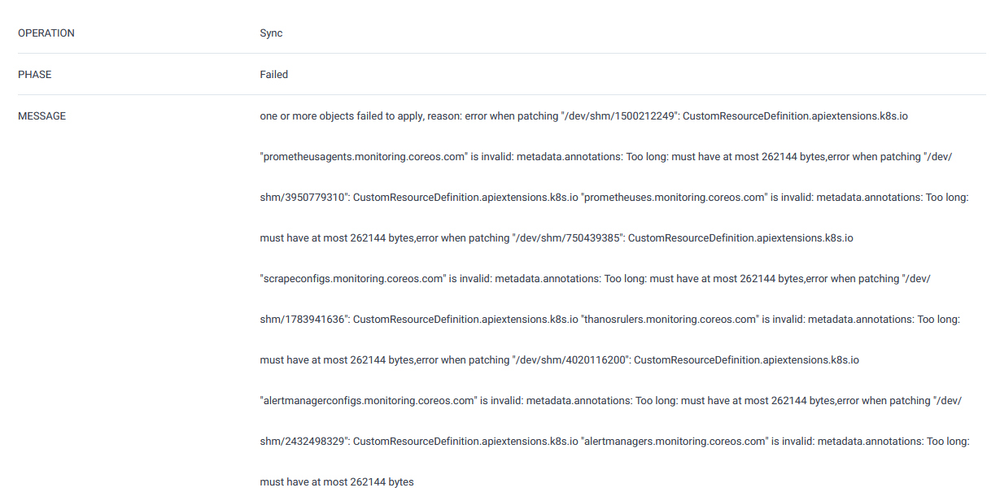
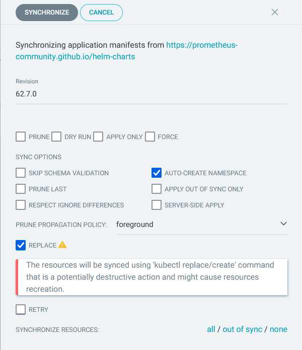
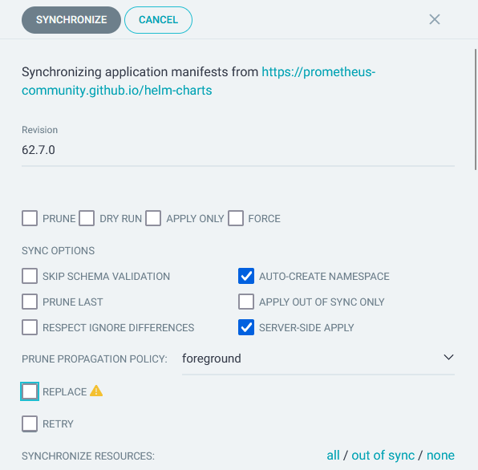

## 課題

kube-prometheus-stack を argocd でデプロイする際、以下の場合に sync failed になることがあります。

- `crds.enabled=true` で Client Side Apply をしたとき
- `crds.enabled=true` で Replace=true で Sync したとき

### `crds.enabled=true` で Client Side Apply をしたとき

Client Side Apply の際、annotations に `kubectl.kubernetes.io/last-applied-configuration`が設定されます。
これのサイズが大きいため apply できないというエラーです。

これを回避するには Replace=true を指定しますが、後述するエラーが発生します。

### `crds.enabled=true` で Replace=true で Sync したとき

こんな感じで Replace にチェックを入れて Sync します。
これによって crds の annotations のサイズデカい問題を回避します。

しかし、以下画像のように失敗してしまいます。

## 整理

- CRD をインストールするときは Replace=true を使いたい
  - `kubectl.kubernetes.io/last-applied-configuration`が大きくなるから
- CRD 以外をインストールするときは Replace=true だとエラーになる
  - 具体的に「なぜか」はわかってないですが argocd の処理的なところかなと勝手に想像しています・・・

## 解決策 1: CRD とそれ以外で Application を別ける

解決する方法として、まず思い浮かんだのは CRD とそれ以外で別々の Application として ArgoCD に登録し管理するという方法です。
実際にそのような管理方法で運用してたりします。

別けることで、CRD は Replace=true で Sync して CRD 以外は Replace=false で Sync できるということです。

## 解決策 2: Server Side Apply を使う

今日知ったのですが、ServerSideApply を使うと `kubectl.kubernetes.io/last-applied-configuration`は登録されません。
そのため、今回の annotations が長い問題は起こりません。
また、annotations が長い問題が起こらなければ Replace=true にする必要がないので CRD も CRD 以外を Replace=false で Sync することができます。

これによって`crds.enabled=true`で CRD とそれ以外を同じ Application で管理できるようにもなりました。
(とはいえ、管理しやすさという観点では CRD を別けておくのも悪くないかなというお気持ちなので、等分は CRD とそれ以外で Application を別けて置こうかなと思います・・・)

## さいごに

表題の通り kube-prometheus-stack を argocd でデプロイする際は Server Side Apply で Sync するのがよさそうです。
特に CRD を一緒にデプロイしたいときはこの方法になると思います。
