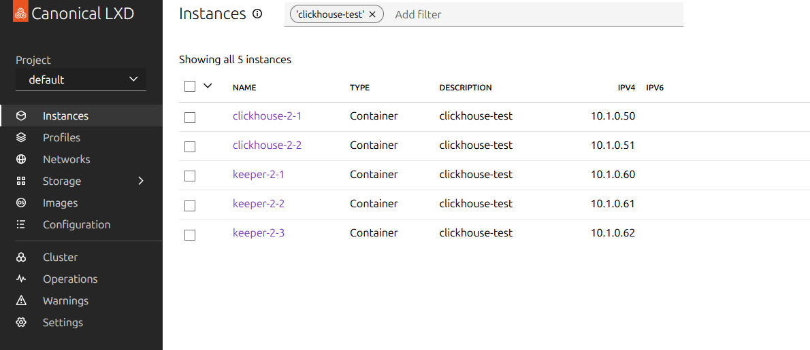
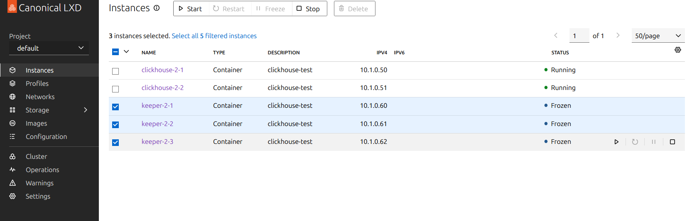

ClickHouse ではメタデータのやり取りを clickhouse-keeper で行います。
この clickhouse-keeper と疎通が取れなくなった時に clickhouse-server でレコードを INSERT できるのか試してみる。

## 結果

先に結果

INSERT はできなくなる。
INSERT の処理が止まりプロンプトが返ってこない状態になる。
その後、keeper との疎通が取れると正常に INSERT された。

## 構成

clickhouse-server 2 台、clickhouse-keeper 3 台を LXD のコンテナで作成し構築した ClickHouse を利用します。

[利用した Playbook](https://github.com/ophum/ansible-clickhouse/tree/c09a60082085870bc8ccaaf5696b9e4a5c4d9ab9)



## 検証

- ReplicatedMergeTree なテーブルを作成する
- clickhouse-2-1 と clickhouse-2-2 のノードで INSERT しレプリケーションされるか確かめる
- keeper-2-1, keeper-2-2, keeper-2-3 を停止させ、clickhouse-2-1 で INSERT できるか試す

## ReplicatedMergeTree なテーブルを作成する

```
clickhouse :) create table test_no_keeper on cluster `{cluster}` (time DateTime, msg String) ENGINE = ReplicatedMergeTree ORDER BY time

CREATE TABLE test_no_keeper ON CLUSTER `{cluster}`
(
    `time` DateTime,
    `msg` String
)
ENGINE = ReplicatedMergeTree
ORDER BY time

Query id: 9b759950-27f5-4401-81c5-9b3daef3f14f

   ┌─host────────────────────────┬─port─┬─status─┬─error─┬─num_hosts_remaining─┬─num_hosts_active─┐
1. │ clickhouse-2-1 │ 9000 │      0 │       │                   1 │                0 │
2. │ clickhouse-2-2 │ 9000 │      0 │       │                   0 │                0 │
   └─────────────────────────────┴──────┴────────┴───────┴─────────────────────┴──────────────────┘

2 rows in set. Elapsed: 0.203 sec.
```

## clickhouse-2-1 と clickhouse-2-2 のノードで INSERT しレプリケーションされるか確かめる

### clickhouse-2-1 で INSERT

```
clickhouse :) insert into test_no_keeper values (NOW(), 'from clickhouse-2-1')

INSERT INTO test_no_keeper FORMAT Values

Query id: 7de84796-963c-40d3-aded-01d663091250

Ok.

1 row in set. Elapsed: 0.093 sec.
```

### clickhouse-2-2 でレプリケーションされているか確認 + INSERT

clickhouse-2-1 で INSERT したレコードがレプリケーションされている。

```
clickhouse :) select * from test_no_keeper

SELECT *
FROM test_no_keeper

Query id: 83379118-4706-4ec9-837b-398b1173575c

   ┌────────────────time─┬─msg─────────────────┐
1. │ 2025-03-01 14:18:18 │ from clickhouse-2-1 │
   └─────────────────────┴─────────────────────┘

1 row in set. Elapsed: 0.002 sec.

clickhouse :) insert into test_no_keeper values (NOW(), 'from clickhouse-2-2')

INSERT INTO test_no_keeper FORMAT Values

Query id: d9d71256-4ba5-4b8a-9920-fe9f1a2bfd60

Ok.

1 row in set. Elapsed: 0.022 sec.
```

### clickhouse-2-1 でレプリケーションされているか確認

clickhouse-2-2 で INSERT したレコードがレプリケーションされている。

```
clickhouse :) select * from test_no_keeper

SELECT *
FROM test_no_keeper

Query id: ca055ed3-fc05-4db9-849c-73b85563d45c

   ┌────────────────time─┬─msg─────────────────┐
1. │ 2025-03-01 14:18:18 │ from clickhouse-2-1 │
2. │ 2025-03-01 14:18:45 │ from clickhouse-2-2 │
   └─────────────────────┴─────────────────────┘

2 rows in set. Elapsed: 0.002 sec.
```

## keeper-2-1, keeper-2-2, keeper-2-3 を停止させ、clickhouse-2-1 で INSERT できるか試す

LXD-ui で各 keeper を Freeze させる。



clickhouse-2-1 で INSERT してみるとこの状態で INSERT されなかった。

```
clickhouse :) insert into test_no_keeper values (NOW(), 'from clickhouse-2-1')

INSERT INTO test_no_keeper FORMAT Values

Query id: e63bdd21-3148-49e7-b49c-20349bb01cfd

↓ Progress: 1.00 rows, 32.00 B (501.01 rows/s., 16.03 KB/s.)                                                                                                                                             (0.3 CPU)
Press the space key to toggle the display of the progress table.
```

keeper を再度動かすと INSERT された。(↑ の Progress が消えて Ok という表示が出た)

```
clickhouse :) insert into test_no_keeper values (NOW(), 'from clickhouse-2-1')

INSERT INTO test_no_keeper FORMAT Values

Query id: e63bdd21-3148-49e7-b49c-20349bb01cfd

Ok.

1 row in set. Elapsed: 62.713 sec.
```
