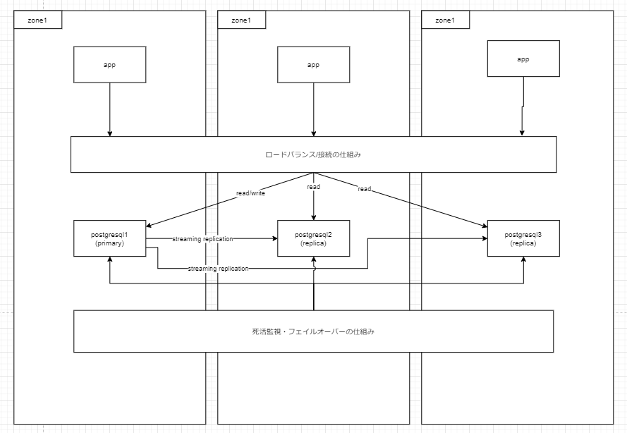
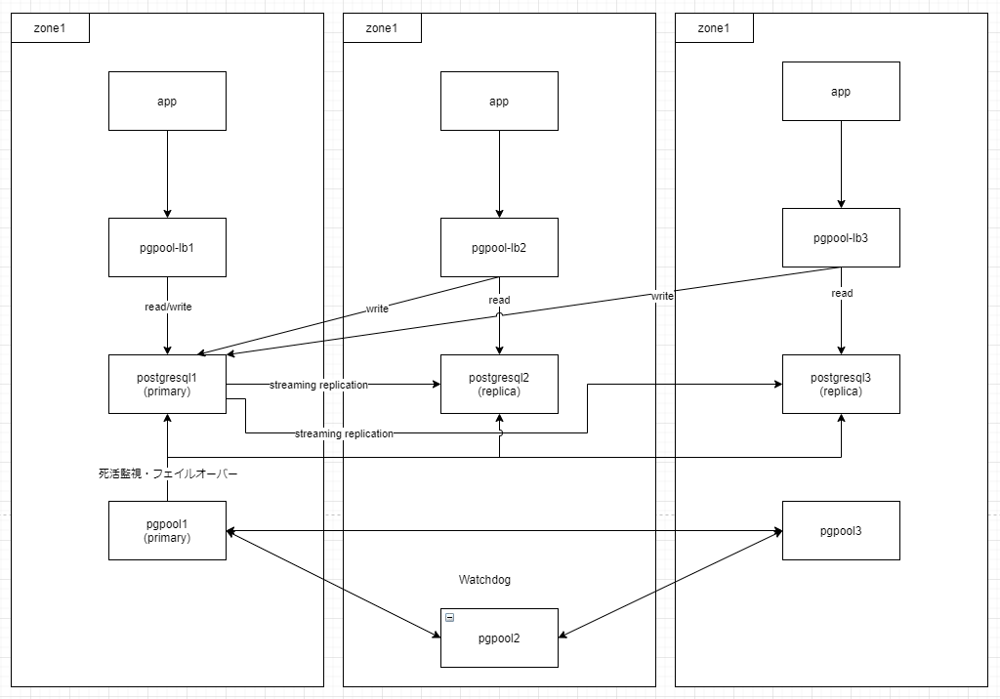
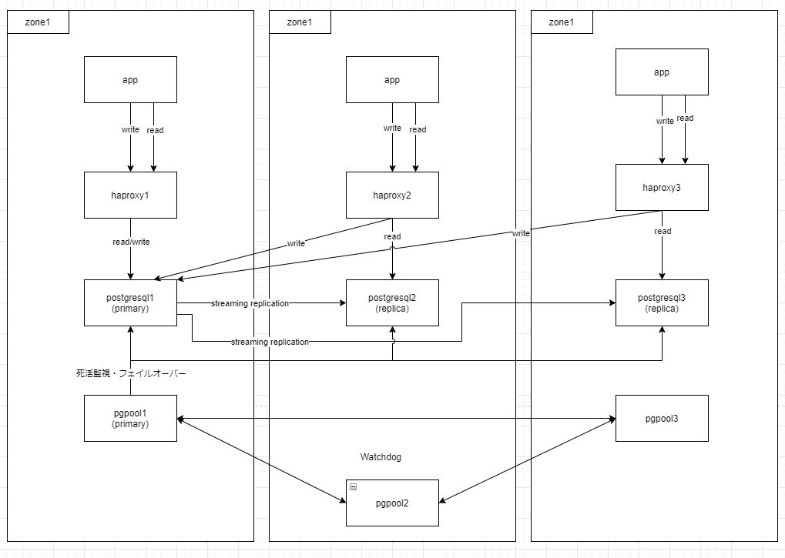
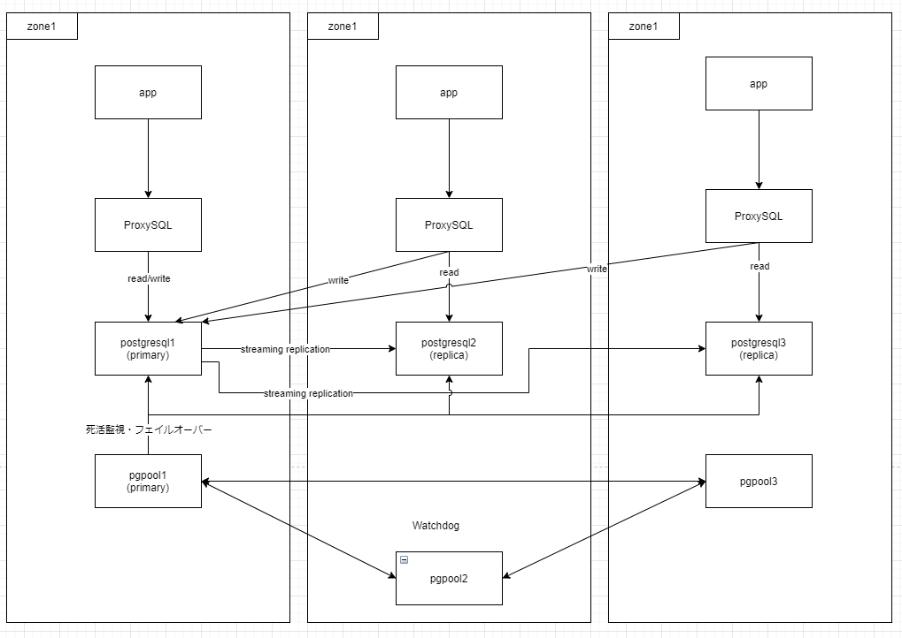

## 概要

以下の項目について考えた脳内 dump

- マルチゾーンで PostgreSQL を稼働させることができるのか
- またその際の課題などを見つける

## 脳内 dump

### マルチゾーンの構成について(想像)

想像上の話。

ゾーンが 3 つあるとする。

各ゾーンに PostgreSQL サーバーがおり、そのうち 1 つが primary サーバーである。
残りが read replica となる。

また、PostgreSQL に接続するアプリケーションも各ゾーンにある想定。

理想は、アプリケーションは自身と同じゾーンにある read replica に READ の問い合わせを行い、WRITE の問い合わせのみ primary サーバーに行う感じ。

これを行えるのか考えてみる。

#### アプリケーションは同じゾーンにある read replica に READ の問い合わせを行いたい理由

- ゾーンをまたぐとアプリケーションのレスポンスタイムが延びる
- 単純に違いところに問い合わせしたほうがレイテンシ―が速い
- `ブラウザ <--> アプリケーション <--> DB`の通信においてアプリケーションと DB 間では整形前のデータをやり取りするため、ブラウザとアプリケーション間の通信に比べてデータ量も多いと思われる。
- WRITE がゾーンをまたぐのは仕方ないし、WRITE が必要な機能(設定を保存など)は遅くても許されると思う。READ オンリーな機能(例えば設定項目の一覧を表示するとき)では遅いと許されない。

### PostgreSQL の冗長構成の方法

PostgreSQL にはレプリケーションの仕組みがありますがフェイルオーバーやロードバランスの仕組みはない。

フェイルオーバーやロードバランスには pgpool-Ⅱ や Patroni(たぶんフェイルオーバーだけ) ProxySQL(ロードバランスだけ)を利用した構成がよくネット上で見られる。

pgpool-Ⅱ について調べてみたところ以下のことがわかった。(試してない)

- pgpool-Ⅱ はロードバランサーとしても動かせる
  - またクエリに応じて primary と read replica への振り分けを制御してくれるので、アプリケーション側で read/write の接続先を気にする必要がない
- pgpool-Ⅱ は PostgreSQL を監視し primary がダウンしたときにフェイルオーバーできる
  - フェイルバックも可能(?)
- pgpool-Ⅱ 自体を冗長構成で構築することができる
  - 3 台以上で構築
  - 1 台が primary となる
  - primary に VIP がつく

### pgpool-Ⅱ をマルチゾーンで利用することができるのか?

pgpool‐Ⅱ の機能を整理すると、3 つの機能があることがわかった。(ほかにもいっぱいありそうだけど)

1. ロードバランサー
2. PostgreSQL の死活監視およびフェイルオーバー
3. pgpool-Ⅱ 自体の冗長構成

#### ロードバランサー機能について

pgpool-Ⅱ がロードバランサーになる。
そのためアプリケーションサーバーは pgpool-Ⅱ に接続することになる。

各ゾーンに pgpool-Ⅱ をロードバランサーとして配置し、アプリケーションは自信と同じゾーンの pgpool-Ⅱ に接続するように設定すれば READ は自身のゾーン内で完結でそう。

#### PostgreSQL の死活監視およびフェイルオーバーについて

pgpool‐Ⅱ が各 PostgreSQL の死活監視を行います。ダウンしている場合はフェイルオーバーさせる。

pgpool-Ⅱ から各 PostgreSQL に疎通できればよさそうに思う。
ただ、1 つのゾーンにしか pgpool-Ⅱ がいない場合は、そのゾーン自体がダウンしたら意味がない。
そのため、pgpool-Ⅱ 自体の冗長化をマルチゾーンで考える必要がありそう。

#### pgpool-Ⅱ 自体の冗長構成

pgpool-Ⅱ には Watchdog という冗長化の機能が備わっている。

仕組みとしては 3 台以上の pgpool-Ⅱ で構成し、そのうちの 1 台が primary として動作する。
3 台以上なのはスプリットブレインを防ぐため。

primary として動作している pgpool-Ⅱ には VIP を設定し、ダウンしたときは他の pgpool-Ⅱ に VIP 設定する。

これを踏まえると以下の課題がありそう。

- pgpool-Ⅱ を各ゾーンに 1 台ずつ配置しても、そのうちの 1 台(1 ゾーン)でしか primary として動かない
  - つまり Zone1~3 のうち、Zone1 で pgpool-Ⅱ が primary として動いていると、Zone2 のアプリケーションは Zone1 の pgpool-Ⅱ につなぐ必要がありそう。
- そもそも、ゾーンが違うとサブネットも違うので VIP は使えないと思う
  - 例えばマルチゾーンでオーバーレイネットワークで L2 延伸するなら或いは?
    - と思ったけど、結局ゾーンをまたぐ通信を行うので遅延する可能性は依然として残ってるし、跨がないようにする制御がより難しくなりそう(できるのか？)。

### pgpool-Ⅱ の機能を踏まえて

- pgpool-Ⅱ の冗長化の仕組み上、単純に pgpool-Ⅱ を各ゾーンに配置するだけではうまくいかなさそう
  - VIP という特性上同じサブネット上に pgpool-Ⅱ のサーバーを配置することが想定されている

#### VIP はロードバランサーのためのもの？

そもそも、VIP は何のために使うのかを考えると、ロードバランサーのためだと思う。
PostgreSQL の死活監視やフェイルオーバーには使わないように思う。

つまり、アプリケーションからの接続先として使われる。

PostgreSQL の死活監視・フェイルオーバーだけを行うだけなら、各ゾーンに配置して Watchdog で自身の冗長化を行っても問題ないのでは?

### pgpool-Ⅱ のロードバランス機能を使わない場合

PostgreSQL の死活監視・フェイルオーバーだけ行うならマルチゾーンでも行けそうな気がしてきた。

この場合、ロードバランスしないのでアプリケーションの接続の仕方を考える必要がある。

- pgpool-Ⅱ を死活監視・フェイルオーバー用とロードバランス用を分ける
  - そもそもできるのか不明
  - ロードバランス時の primary/replica の判別をどうしているのか?
- HAProxy でロードバランス
  - primary/replica の判別をどうするのか
- ProxySQL でロードバランス
  - primary/replica の判別をどうするのか

雑に調べた感じだと、primary/replica を固定で設定している例が多く、フェイルオーバー時の切り替えまでやっている記事は見つけらなかった。

- HAProxy の場合は、ヘルスチェックで primary かどうかを問い合わせるかんじ?
  - write 用、read 用でエンドポイントを分ける(port 別けるなど)
  - write 用は、ヘルスチェックで primary 判定したサーバーに
  - read 用は、ヘルスチェックで primary 判定しなかったサーバーに
- ProxySQL は 設定用のインターフェースがありそうなので pgpool-Ⅱ のフェイルオーバー時に設定を変更する?
  - 設定変更の仕組みを作れば HAProxy でもできそう

### 構成案

#### 1. pgpool-Ⅱ で 死活監視・フェイルオーバー+ ロードバランス

この図を描いていて思ったけど、pgpool-Ⅱ はレプリケーションの遅延とかも見るような気がしたし、死活監視しないと生きてるサーバーにロードバランスできないし、どれが primary かも分からない気がした。
なので、死活監視は lb 用でも行うがフェイルオーバーを別の pgpool-Ⅱ に任せるという感じか。

果たしてできるのかは不明。

#### 2. pgpool-Ⅱ で死活監視・フェイルオーバー、HAProxy でロードバランス

構成案 1 の pgpool-lb が HAProxy になり、Read/Write でエンドポイントが変わる

#### 3. pgpool-Ⅱ で死活監視・フェイルオーバー、ProxySQL でロードバランス

構成案 1 の pgpoool-lb が ProxySQL になる。

## どの構成がよさそうか

pgpool-Ⅱ で死活監視・フェイルオーバーしつつ、VIP を使わない何かしらのロードバランサーを利用するのがよさそうだなというお気持ちに。

pgpool‐Ⅱ だけで完結できるなら構成案 1 だし、うまく ProxySQL 使えるなら構成案 3 かなと。
やはり、アプリケーション側は透過的に DB に接続できると嬉しい。

構成案 2 は READ/WRITE で接続先が変わってアプリケーション側の対応が必要になるけど、マルチゾーンで可用性の高い環境になることを考えるとメリットはあると思う。

実際に構築して検証しないとな・・・(これを書くと大抵やらない)
