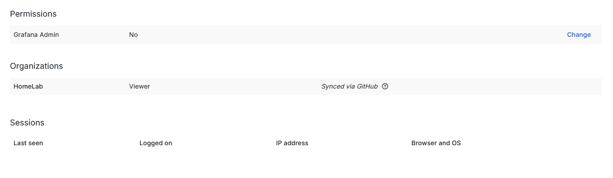

Grafana に GitHub OAuth でログインできるようにしてみます。

要件としてはシンプルにログインできることだけを行います。

## ドキュメント

これ通りにやるだけ

https://grafana.com/docs/grafana/latest/setup-grafana/configure-security/configure-authentication/github/

## GitHub OAuth App を作成する

`Application name`と`Homepage URL`には適当なモノを設定します。
`Authorization callback URL`には、`<root_url>/login/github`という感じで入れます。
テスト環境の Grafana の`<root_url>`は`http://10.1.0.41:3000/`なので`http://10.1.0.41:3000/login/github`を設定します。


## /etc/grafana/grafana.ini を編集する

`[auth.github]`というセクションがあるのでそこに以下のように編集します。
デフォルトでは全てコメントアウトされているので任意の設定を有効にします。

他にもいろいろありますが、今回は以下のものだけ設定してみました。

```bash
root@grafana:~# vim /etc/grafana/grafana.ini
```

```toml
[auth.github]
name = GitHub
icon = github
enabled = true
allow_sign_up = true
client_id = <GitHub Oauth AppのClient ID>
client_secret = <GitHub Oauth Appで生成したClient secret>
```

| 設定項目        | 説明                                                                                   |
| --------------- | -------------------------------------------------------------------------------------- |
| `name`          | ログイン画面で表示される名前 `Sign in with <name>`というボタンが表示されます           |
| `icon`          | ログイン画面で表示されるアイコン `Sign in with <name>`というボタンのアイコンになります |
| `enabled`       | GitHub Oauth を使った認証を有効にします。                                              |
| `allow_sign_up` | ユーザーが存在しないときに作成するかどうか。`false=作成しない` `true=作成する`         |
| `client_id`     | GitHub Oauth App の Client ID                                                          |
| `client_secret` | GitHub Oauth App の Client secret                                                      |

## 設定を反映する

```
root@grafana:~# systemctl restart grafana-server
```

## 動作確認

ログインページに `Sign in with GitHub`というボタンが追加されていることが確認できました。


クリックすると GitHub の認可の確認ページに遷移します。


`Authorize <id>`をクリックすると Grafana にログインされます。


### 権限に関して

新しくユーザーが作成されると Viewer 権限で作成されます。また Grafana 自体の管理者権限もありません。

(管理ユーザーでログインしなおしてユーザーの設定情報を閲覧)


今回は GitHub の Organization やチーム、ロールなどと同期する設定をしていません。
そのため、Grafana での権限に関しては admin ユーザーが手動で変更する必要があります。
GitHub 側でチームやメンバーの権限管理を行っている場合は、うまくマッピングしてあげると運用が楽になりそうです。
逆に管理していない場合や少人数での利用の場合は、都度手動で権限を変更するという運用で問題ないと思います。

### 注意点

だれでもアクセス可能な場所で Grafana を運用している場合は、GitHub アカウントがあれば Grafana にユーザーを作れてしまいます。
そのため、任意のユーザーのみログインできるように制限する必要があります。
Organization やチームと同期する設定をするか、`allow_sign_up=false`としてユーザーの自動作成を無効にするなどの対策が必要になると思います。
