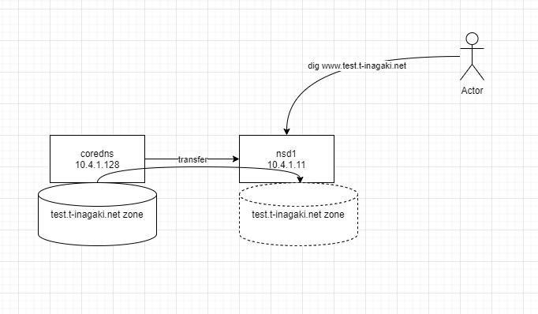

CoreDNS にゾーン転送を行うプラグイン ([transfer](https://coredns.io/plugins/transfer/))があるので試してみます。
CoreDNS はバックエンドに etcd を用いることができるのでレコードの追加を動的に行えるのがメリットかなと思いました。
また、ゾーン転送を行うことで CoreDNS は hidden primary として扱い、転送先のセカンダリネームサーバが外部からのアクセスを受けるという構成を取れると考えました。

また、今回は転送先に NSD を利用してみます。
NSD を選択する理由は NSD 使ったことないので触ってみたいというのが大きいです。

## 注意

- DNS 初心者なので適当なこと書いてる可能性高いです

## 構成図



## NSD をセットアップする

### インストール

https://nsd.docs.nlnetlabs.nl/en/latest/installation.html

```bash
root@nsd1:~# apt update
root@nsd1:~# apt install nsd
```

### 設定

ubuntu は systemd-resolved が 127.0.0.53 で 53 ポートを使っているため 0.0.0.0 で LISTEN できません。
nsd が bind する IP アドレス を指定しておきます。

```
root@nsd1:~# cat /etc/nsd/nsd.conf.d/server.conf
server:
        ip-address: 10.4.1.11
```

次にセカンダリゾーンの設定を行います。
`10.4.1.128`は CoreDNS です。今回はお試しなので`NOKEY`としています。

```
root@nsd1:~# cat /etc/nsd/nsd.conf.d/secondary.conf
zone:
        name: test.t-inagaki.net
        allow-notify: 10.4.1.128 NOKEY
        request-xfr: 10.4.1.128 NOKEY
```

nsd を再起動します。

```
systemctl restart nsd
```

CoreDNS を起動していないので NSD のログを見ると接続できていないエラーが出力されています。

```
$ journalctl -u nsd
Apr 13 04:52:35 nsd1 systemd[1]: Starting nsd.service - Name Server Daemon...
Apr 13 04:52:35 nsd1 nsd[1408]: nsd starting (NSD 4.8.0)
Apr 13 04:52:35 nsd1 nsd[1409]: nsd started (NSD 4.8.0), pid 1408
Apr 13 04:52:35 nsd1 nsd[1408]: test.t-inagaki.net: Could not tcp connect to 10.4.1.128: Connection refused
Apr 13 04:52:35 nsd1 systemd[1]: Started nsd.service - Name Server Daemon.
```

## CoreDNS の設定

Corefile を書きます。

Corefile
CoreDNS も同じく systemd-resolved と競合するため bind する IP アドレスを指定します。

file plugin で`db.test.t-inagaki.net`ファイルに定義したゾーンを読み込みます。
transfer plugin で全てのゾーンを 10.4.1.11 (NSD)に転送します。

```
. {
        bind 10.4.1.128
        log
        errors
        file db.test.t-inagaki.net test.t-inagaki.net {
                reload 10s
        }

        transfer {
                to * 10.4.1.11
        }
}
```

db.test.t-inagaki.net
とりあえず、最小限のレコード?を設定してみた。

(あってるかわからないけど)

```
@       3600 IN SOA primary.test.t-inagaki.net. root.t-inagaki.net. 2025041301 7200 3600 1209600 3600
        3600 IN NS primary.test.t-inagaki.net.
        3600 IN A 10.4.1.128

www     3600 IN A 10.4.1.128
```

### 実行

起動すると NSD に`test.t-inagaki.net.`ゾーンを転送したことがログに出力されます。

```
root@coredns:~/coredns# ./coredns
maxprocs: Leaving GOMAXPROCS=16: CPU quota undefined
.:53 on 10.4.1.128
CoreDNS-1.12.1
linux/amd64, go1.24.1, 707c7c1
[INFO] plugin/transfer: Outgoing transfer of 5 records of zone "test.t-inagaki.net." to 10.4.1.11 for 2025041301 SOA serial
[INFO] 10.4.1.11:54246 - 43722 "AXFR IN test.t-inagaki.net. tcp 36 false 65535" NOERROR qr,aa 362 0.000089097s
```

NSD 側のログを見てみるとゾーンを更新したログが出力されていました。

```
Apr 13 04:55:44 nsd1 nsd[1425]: zone test.t-inagaki.net serial is updated to 2025041301
```

NSD に対して dig を実行し名前解決できるか確かめてみます。

SOA を取得できました。

```
hum@ryzen5pc:~$ dig @10.4.1.11 SOA test.t-inagaki.net

; <<>> DiG 9.18.30-0ubuntu0.24.04.2-Ubuntu <<>> @10.4.1.11 SOA test.t-inagaki.net
; (1 server found)
;; global options: +cmd
;; Got answer:
;; ->>HEADER<<- opcode: QUERY, status: NOERROR, id: 17668
;; flags: qr aa rd; QUERY: 1, ANSWER: 1, AUTHORITY: 1, ADDITIONAL: 1
;; WARNING: recursion requested but not available

;; OPT PSEUDOSECTION:
; EDNS: version: 0, flags:; udp: 1232
;; QUESTION SECTION:
;test.t-inagaki.net.            IN      SOA

;; ANSWER SECTION:
test.t-inagaki.net.     3600    IN      SOA     primary.test.t-inagaki.net. root.t-inagaki.net. 2025041301 7200 3600 1209600 3600

;; AUTHORITY SECTION:
test.t-inagaki.net.     3600    IN      NS      primary.test.t-inagaki.net.

;; Query time: 9 msec
;; SERVER: 10.4.1.11#53(10.4.1.11) (UDP)
;; WHEN: Sun Apr 13 13:57:58 JST 2025
;; MSG SIZE  rcvd: 110

```

`www.test.t-inagaki.net`の名前解決ができました。

```
hum@ryzen5pc:~$ dig @10.4.1.11 www.test.t-inagaki.net

; <<>> DiG 9.18.30-0ubuntu0.24.04.2-Ubuntu <<>> @10.4.1.11 www.test.t-inagaki.net
; (1 server found)
;; global options: +cmd
;; Got answer:
;; ->>HEADER<<- opcode: QUERY, status: NOERROR, id: 15655
;; flags: qr aa rd; QUERY: 1, ANSWER: 1, AUTHORITY: 1, ADDITIONAL: 1
;; WARNING: recursion requested but not available

;; OPT PSEUDOSECTION:
; EDNS: version: 0, flags:; udp: 1232
;; QUESTION SECTION:
;www.test.t-inagaki.net.                IN      A

;; ANSWER SECTION:
www.test.t-inagaki.net. 3600    IN      A       10.4.1.128

;; AUTHORITY SECTION:
test.t-inagaki.net.     3600    IN      NS      primary.test.t-inagaki.net.

;; Query time: 9 msec
;; SERVER: 10.4.1.11#53(10.4.1.11) (UDP)
;; WHEN: Sun Apr 13 13:58:23 JST 2025
;; MSG SIZE  rcvd: 89
```

## CoreDNS のゾーンファイルを更新する

CoreDNS のゾーンファイルを更新し NSD に転送されるか試してみます。

以下のように変更しました。

- SOA のシリアルをインクリメントしました。
- www に IP アドレスを 計 2 つ設定しました。

```
root@coredns:~/coredns# diff -u db.test.t-inagaki.net.2025041301 db.test.t-inagaki.net
--- db.test.t-inagaki.net.2025041301    2025-04-13 05:00:35.509992458 +0000
+++ db.test.t-inagaki.net       2025-04-13 05:00:46.500960548 +0000
@@ -1,6 +1,7 @@
-@      3600 IN SOA primary.test.t-inagaki.net. root.t-inagaki.net. 2025041301 7200 3600 1209600 3600
+@      3600 IN SOA primary.test.t-inagaki.net. root.t-inagaki.net. 2025041302 7200 3600 1209600 3600
        3600 IN NS primary.test.t-inagaki.net.
        3600 IN A 10.4.1.128

 www    3600 IN A 10.4.1.128
+www    3600 IN A 10.4.1.129
```

CoreDNS の file plugin に reload 10s を設定しているので 10 秒待つとリロードされ以下のログが出力されました。
ゾーンのリロードが成功し、serial 2025041302 のゾーン情報を転送したことがわかります。

```
[INFO] plugin/file: Successfully reloaded zone "test.t-inagaki.net." in "db.test.t-inagaki.net" with 2025041302 SOA serial
[INFO] plugin/transfer: Outgoing transfer of 6 records of zone "test.t-inagaki.net." to 10.4.1.11 for 2025041302 SOA serial
[INFO] 10.4.1.11:37642 - 1351 "IXFR IN test.t-inagaki.net. tcp 134 false 65535" NOERROR qr,aa 400 0.000105227s
```

NSD のログでも serial 2025041302 のゾーン情報に更新されたことがわかります。

```
Apr 13 05:00:54 nsd1 nsd[1425]: zone test.t-inagaki.net serial 2025041301 is updated to 2025041302
```

dig で `www.test.t-inagaki.net`の名前解決をしてみると、IP アドレスが 2 つ返ってきていることがわかります。

```
hum@ryzen5pc:~$ dig @10.4.1.11 www.test.t-inagaki.net

; <<>> DiG 9.18.30-0ubuntu0.24.04.2-Ubuntu <<>> @10.4.1.11 www.test.t-inagaki.net
; (1 server found)
;; global options: +cmd
;; Got answer:
;; ->>HEADER<<- opcode: QUERY, status: NOERROR, id: 41278
;; flags: qr aa rd; QUERY: 1, ANSWER: 2, AUTHORITY: 1, ADDITIONAL: 1
;; WARNING: recursion requested but not available

;; OPT PSEUDOSECTION:
; EDNS: version: 0, flags:; udp: 1232
;; QUESTION SECTION:
;www.test.t-inagaki.net.                IN      A

;; ANSWER SECTION:
www.test.t-inagaki.net. 3600    IN      A       10.4.1.128
www.test.t-inagaki.net. 3600    IN      A       10.4.1.129

;; AUTHORITY SECTION:
test.t-inagaki.net.     3600    IN      NS      primary.test.t-inagaki.net.

;; Query time: 0 msec
;; SERVER: 10.4.1.11#53(10.4.1.11) (UDP)
;; WHEN: Sun Apr 13 14:04:59 JST 2025
;; MSG SIZE  rcvd: 105
```

## さいごに

NSD をセカンダリ―ネームサーバとして動作するように設定し、プライマリネームサーバとして動作している CoreDNS からゾーン情報を転送することができました。

ちなみに、CoreDNS の plugin にはセカンダリネームサーバとして動かす用の plugin があります。
これを使えば、NSD を使わずに CoreDNS だけで同じようなことをできると思います。(未検証)

CoreDNS は内部向けで使われていることが多く、外部向けなら BIND9 や NSD などのほうが事例が多いように思います。
そういう観点では、etcd を使えばレコードの追加が容易になる CoreDNS を hidden primary として動かし、外部からリクエストを受けるところは NSD とする今回の構成は理にかなってるのかなと思いました。
