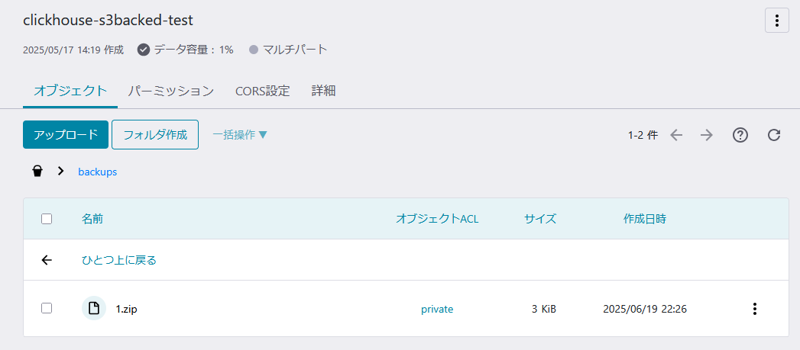

https://clickhouse.com/docs/operations/backup

環境は docker-compose-recipes の cluster_1S_2R を利用した。
https://github.com/ClickHouse/examples/blob/5d56c8003b50a42a5cc58fdf9f8189b9cc148f1b/docker-compose-recipes/recipes/cluster_1S_2R/README.md

試したバージョンは `23.4.6.25`

```bash
clickhouse@clickhouse-01:/$ clickhouse-server --version
ClickHouse server version 23.4.6.25 (official build).
```

ローカルにバせせックアップを取れるように設定しておく。

```diff
hum@ryzen5pc:~/github.com/ClickHouse/examples/docker-compose-recipes/recipes/cluster_1S_2R$ git diff
diff --git a/docker-compose-recipes/recipes/cluster_1S_2R/fs/volumes/clickhouse-01/etc/clickhouse-server/config.d/config.xml b/docker-compose-recipes/recipes/cluster_1S_2R/fs/volumes/clickhouse-01/etc/clickhouse-server/config.d/config.xml
index 27a141d..cfe831f 100644
--- a/docker-compose-recipes/recipes/cluster_1S_2R/fs/volumes/clickhouse-01/etc/clickhouse-server/config.d/config.xml
+++ b/docker-compose-recipes/recipes/cluster_1S_2R/fs/volumes/clickhouse-01/etc/clickhouse-server/config.d/config.xml
@@ -1,4 +1,16 @@
 <clickhouse replace="true">
+               <storage_configuration>
+                               <disks>
+                                               <backups>
+                                                               <type>local</type>
+                                                               <path>/tmp/backups/</path>
+                                               </backups>
+                               </disks>
+               </storage_configuration>
+               <backups>
+                       <allowed_disk>backups</allowed_disk>
+                       <allowed_path>/tmp/backups/</allowed_path>
+               </backups>
     <logger>
         <level>debug</level>
         <log>/var/log/clickhouse-server/clickhouse-server.log</log>
diff --git a/docker-compose-recipes/recipes/cluster_1S_2R/fs/volumes/clickhouse-02/etc/clickhouse-server/config.d/config.xml b/docker-compose-recipes/recipes/cluster_1S_2R/fs/volumes/clickhouse-02/etc/clickhouse-server/config.d/config.xml
index e35f6cc..f120593 100644
--- a/docker-compose-recipes/recipes/cluster_1S_2R/fs/volumes/clickhouse-02/etc/clickhouse-server/config.d/config.xml
+++ b/docker-compose-recipes/recipes/cluster_1S_2R/fs/volumes/clickhouse-02/etc/clickhouse-server/config.d/config.xml
@@ -1,4 +1,16 @@
 <clickhouse replace="true">
+               <storage_configuration>
+                               <disks>
+                                               <backups>
+                                                               <type>local</type>
+                                                               <path>/tmp/backups/</path>
+                                               </backups>
+                               </disks>
+               </storage_configuration>
+               <backups>
+                       <allowed_disk>backups</allowed_disk>
+                       <allowed_path>/tmp/backups/</allowed_path>
+               </backups>
     <logger>
         <level>debug</level>
         <log>/var/log/clickhouse-server/clickhouse-server.log</log>
```

## ディスクにバックアップを作成し復元してみる

### テーブルを作る

```
cluster_1S_2R node 1 :) CREATE TABLE test ON CLUSTER `{cluster}` (
    id Int64,
    name String
)
ENGINE = ReplicatedMergeTree
ORDER BY id
;

CREATE TABLE test ON CLUSTER `{cluster}`
(
    `id` Int64,
    `name` String
)
ENGINE = ReplicatedMergeTree
ORDER BY id

Query id: 69f50a87-e400-417d-8861-421d0259366c

┌─host──────────┬─port─┬─status─┬─error─┬─num_hosts_remaining─┬─num_hosts_active─┐
│ clickhouse-02 │ 9000 │      0 │       │                   1 │                0 │
│ clickhouse-01 │ 9000 │      0 │       │                   0 │                0 │
└───────────────┴──────┴────────┴───────┴─────────────────────┴──────────────────┘

2 rows in set. Elapsed: 0.125 sec.
```

### テストデータを挿入する

```
cluster_1S_2R node 1 :) INSERT INTO test (id, name) VALUES (1, 'abc'),(2, 'def')

INSERT INTO test (id, name) FORMAT Values

Query id: 8389a6db-e2c7-49f6-9229-a164fb0407ef

Ok.

2 rows in set. Elapsed: 0.014 sec.
```

#### 挿入されたことを確認する

clickhouse-01, clickhouse-02 の両方にデータがあることを確認できた。

```
hum@ryzen5pc:~/github.com/ClickHouse/examples/docker-compose-recipes/recipes/cluster_1S_2R
$ docker compose exec -it clickhouse-01 clickhouse-client --query 'SELECT * FROM test'
1       abc
2       def
hum@ryzen5pc:~/github.com/ClickHouse/examples/docker-compose-recipes/recipes/cluster_1S_2R
$ docker compose exec -it clickhouse-02 clickhouse-client --query 'SELECT * FROM test'
1       abc
2       def
```

### バックアップを取得する

```
cluster_1S_2R node 1 :) BACKUP TABLE default.test TO Disk('backups', '1.zip')

BACKUP TABLE default.test TO Disk('backups', '1.zip')

Query id: bba806fd-5411-46e9-80fc-1b299b24a166

┌─id───────────────────────────────────┬─status─────────┐
│ ca0cafdd-1e55-4fcd-8aed-0c0433cc062b │ BACKUP_CREATED │
└──────────────────────────────────────┴────────────────┘

1 row in set. Elapsed: 0.004 sec.
```

#### ON CLUSTER を付けると対応していないのでエラーになる

```
cluster_1S_2R node 1 :) BACKUP TABLE default.test ON CLUSTER `{cluster}` TO Disk('backups', '2.zip'


BACKUP TABLE default.test ON CLUSTER `{cluster}` TO Disk('backups', '2.zip')

Query id: 91108caa-86a5-44d1-8d4e-3be5c93c0660


0 rows in set. Elapsed: 0.366 sec.

Received exception from server (version 23.4.6):
Code: 344. DB::Exception: Received from localhost:9000. DB::Exception: Got error from clickhouse%2D01:9000. DB::Exception: Using archives with backups on clusters is disabled. (SUPPORT_IS_DISABLED)
```

### RESTORE の際に ON CLUSTER がないとエラーになる

RESTORE しようとすると ReplicatedMergeTree なので ON CLUSTER が必要ということでエラーになる。

```
cluster_1S_2R node 1 :) RESTORE TABLE default.test AS default.test2 FROM Disk('backups', '1.zip')

RESTORE TABLE default.test AS default.test2 FROM Disk('backups', '1.zip')

Query id: cfba8a99-78c2-4055-9310-44b7c61cad69


0 rows in set. Elapsed: 0.002 sec.

Received exception from server (version 23.4.6):
Code: 36. DB::Exception: Received from localhost:9000. DB::Exception: Macro 'uuid' and empty arguments of ReplicatedMergeTree are supported only for ON CLUSTER queries with Atomic database engine: While creating table default.test2. (BAD_ARGUMENTS)
```

#### ON CLUSTER を付けると 1.zip が clickhouse-02 にないのでエラーになる。(それはそう)

```
cluster_1S_2R node 1 :) RESTORE TABLE default.test AS default.test2 ON CLUSTER `{cluster}` FROM Disk('backups', '1.zip')

RESTORE TABLE default.test AS default.test2 ON CLUSTER `{cluster}` FROM Disk('backups', '1.zip')

Query id: cc7275a5-e3f1-402e-ab68-addb07295634


0 rows in set. Elapsed: 0.382 sec.

Received exception from server (version 23.4.6):
Code: 599. DB::Exception: Received from localhost:9000. DB::Exception: Got error from clickhouse%2D02:9000. DB::Exception: Backup Disk('backups', '1.zip') not found. (BACKUP_NOT_FOUND)
```

#### 1.zip を clickhouse-02 にコピーし RESTORE してみる

コピーする

```
hum@ryzen5pc:~/github.com/ClickHouse/examples/docker-compose-recipes/recipes/cluster_1S_2R
$ docker compose cp clickhouse-01:/tmp/backups/1.zip ./
[+] Copying 1/1
 ✔ clickhouse-01 copy clickhouse-01:/tmp/backups/1.zip to ./ Copied                            0.0s
hum@ryzen5pc:~/github.com/ClickHouse/examples/docker-compose-recipes/recipes/cluster_1S_2R
$ chmod 755 1.zip
hum@ryzen5pc:~/github.com/ClickHouse/examples/docker-compose-recipes/recipes/cluster_1S_2R
$ docker compose cp 1.zip clickhouse-02:/tmp/backups/1.zip
[+] Copying 1/1
 ✔ clickhouse-02 copy 1.zip to clickhouse-02:/tmp/backups/1.zip Copied
```

RESTORE できた

```
cluster_1S_2R node 1 :) RESTORE TABLE default.test AS default.test2 ON CLUSTER `{cluster}` FROM Disk('backups', '1.zip')

RESTORE TABLE default.test AS default.test2 ON CLUSTER `{cluster}` FROM Disk('backups', '1.zip')

Query id: 8d3f7484-dee5-46c4-9755-a3c1a1250d5b

┌─id───────────────────────────────────┬─status───┐
│ 365a980b-07c3-4835-8f5d-8985bb152ac9 │ RESTORED │
└──────────────────────────────────────┴──────────┘

1 row in set. Elapsed: 0.303 sec.
```

データも両方のノードで確認できる。

```
hum@ryzen5pc:~/github.com/ClickHouse/examples/docker-compose-recipes/recipes/cluster_1S_2R
$ docker compose exec -it clickhouse-01 clickhouse-client --query 'SELECT * FROM test2'
1       abc
2       def
hum@ryzen5pc:~/github.com/ClickHouse/examples/docker-compose-recipes/recipes/cluster_1S_2R
$ docker compose exec -it clickhouse-02 clickhouse-client --query 'SELECT * FROM test2'
1       abc
2       def
```

## S3 にバックアップを取ってみる

```
cluster_1S_2R node 1 :) BACKUP TABLE default.test TO S3('https://s3.isk01.sakurastorage.jp/<bucket>/backups/1.zip', '<access_key_id>', '<secret_access_key>')

BACKUP TABLE default.test TO S3('https://s3.isk01.sakurastorage.jp/<bucket>/backups/1.zip', '<access_key_id>', '<secret_access_key>')

Query id: 0d34b227-8340-4c67-b093-650a363f5588

┌─id───────────────────────────────────┬─status─────────┐
│ f26664c9-3e2a-4ac0-9ac9-f0b006a9933a │ BACKUP_CREATED │
└──────────────────────────────────────┴────────────────┘

1 row in set. Elapsed: 1.683 sec.
```



### S3 のバックアップから RESTORE してみる

先ほどと同じく ON CLUSTER がなくてエラー

```
cluster_1S_2R node 1 :) RESTORE TABLE default.test AS default.test3 FROM S3('https://s3.isk01.sakurastorage.jp/<bucket>/backups/1.zip', '<access_key_id>', '<secret_access_key>')

RESTORE TABLE default.test AS default.test3 FROM S3('https://s3.isk01.sakurastorage.jp/<bucket>/backups/1.zip', '<access_key_id>', '<secret_access_key>')

Query id: 021bfbbf-6666-443a-870e-fbede593a35b


0 rows in set. Elapsed: 0.928 sec.

Received exception from server (version 23.4.6):
Code: 36. DB::Exception: Received from localhost:9000. DB::Exception: Macro 'uuid' and empty arguments of ReplicatedMergeTree are supported only for ON CLUSTER queries with Atomic database engine: While creating table default.test3. (BAD_ARGUMENTS)
```

ON CLUSTER を入れると RESTORE できた。

```
cluster_1S_2R node 1 :) RESTORE TABLE default.test AS default.test3 ON CLUSTER `{cluster}` FROM S3('https://s3.isk01.sakurastorage.jp/<bucket>/backups/1.zip', '<access_key_id>', '<secret_access_key>')

RESTORE TABLE default.test AS default.test3 ON CLUSTER `{cluster}` FROM S3('https://s3.isk01.sakurastorage.jp/<bucket>/backups/1.zip', '<access_key_id>', '<secret_access_key>')

Query id: 216f73d2-e96e-478a-bf9d-25e781b36dee

┌─id───────────────────────────────────┬─status───┐
│ c1f03fd9-ee95-4096-b0d1-46d18f6e7cce │ RESTORED │
└──────────────────────────────────────┴──────────┘

1 row in set. Elapsed: 15.223 sec
```

## パーティション単位のバックアップを試す

1 分単位でパーティションを切る設定にしてみる。

```
cluster_1S_2R node 1 :) CREATE TABLE parted_test ON CLUSTER `{cluster}` (
    time DateTime64,
    Name String
)
ENGINE = ReplicatedMergeTree
ORDER BY time
PARTITION BY toStartOfMinute(time)
;

CREATE TABLE parted_test ON CLUSTER `{cluster}`
(
    `time` DateTime64,
    `Name` String
)
ENGINE = ReplicatedMergeTree
PARTITION BY toStartOfMinute(time)
ORDER BY time

Query id: 4e8f5e09-1faa-455f-8dc0-a43ce7238192

┌─host──────────┬─port─┬─status─┬─error─┬─num_hosts_remaining─┬─num_hosts_active─┐
│ clickhouse-01 │ 9000 │      0 │       │                   1 │                0 │
│ clickhouse-02 │ 9000 │      0 │       │                   0 │                0 │
└───────────────┴──────┴────────┴───────┴─────────────────────┴──────────────────┘

2 rows in set. Elapsed: 0.120 sec.
```

```
cluster_1S_2R node 1 :) INSERT INTO parted_test VALUES ('2025-06-19 00:00:00', 'abc'), ('2025-06-19 00:00:01', 'def'), ('2025-06-19 00:01:00', 'ghi'), ('2025-06-19 00:01:01', 'jkl');

INSERT INTO parted_test FORMAT Values

Query id: 26064124-1eef-4222-924a-c538fbb7b095

Ok.

4 rows in set. Elapsed: 0.031 sec.INSERT INTO parted_test VALUES ('2025-06-19 00:00:00', 'abc'), ('2025-06-19 00:00:01', 'def'), ('2025-06-19 00:01:00', 'ghi'), ('2025-06-19 00:01:01', 'jkl');
```

```
cluster_1S_2R node 1 :) SELECT * FROM parted_test

SELECT *
FROM parted_test

Query id: 303320e7-2cdf-48b9-9b60-b099c9defe82

┌────────────────────time─┬─Name─┐
│ 2025-06-19 00:01:00.000 │ ghi  │
│ 2025-06-19 00:01:01.000 │ jkl  │
└─────────────────────────┴──────┘
┌────────────────────time─┬─Name─┐
│ 2025-06-19 00:00:00.000 │ abc  │
│ 2025-06-19 00:00:01.000 │ def  │
└─────────────────────────┴──────┘

4 rows in set. Elapsed: 0.002 sec.
```

### `2025-06-19 00:00:00`のパーティションのバックアップを S3 に取る

```
cluster_1S_2R node 1 :) BACKUP TABLE default.parted_test PARTITION '2025-06-19 00:00:00' TO S3('https://s3.isk01.sakurastorage.jp/<bucket>/backups/20250619T0000.zip', '<access_key_id>', '<secret_access_key>')

BACKUP TABLE default.parted_test PARTITION  '2025-06-19 00:00:00' TO S3('https://s3.isk01.sakurastorage.jp/<bucket>/backups/20250619T0000.zip', '<access_key_id>', '<secret_access_key>')

Query id: 7353f250-cc1c-4660-b309-d40371878b2d

┌─id───────────────────────────────────┬─status─────────┐
│ 1238f2d5-45e7-4e45-9616-4a1b309ee70b │ BACKUP_CREATED │
└──────────────────────────────────────┴────────────────┘

1 row in set. Elapsed: 1.613 sec.BACKUP TABLE default.parted_test PARTITION '2025-06-19 00:00:00' TO S3('https://s3.isk01.sakurastorage.jp/<bucket>/backups/20250619T0000.zip', '<access_key_id>', '<secret_access_key>')
```

### RESTORE する

```
cluster_1S_2R node 1 :) RESTORE TABLE default.parted_test AS default.parted_test2 ON CLUSTER `{cluster}` FROM S3('https://s3.isk01.sakurastorage.jp/<bucket>/backups/20250619T0000.zip', '<access_key_id>', '<secret_access_key>')

RESTORE TABLE default.parted_test AS default.parted_test2 ON CLUSTER `{cluster}` FROM S3('https://s3.isk01.sakurastorage.jp/<bucket>/backups/20250619T0000.zip', '<access_key_id>', '<secret_access_key>')

Query id: 5b71fefd-4d46-43ee-98b2-a2125abe19d6

┌─id───────────────────────────────────┬─status───┐
│ 59d486bb-7fd7-4b5b-811e-dbb37565ff79 │ RESTORED │
└──────────────────────────────────────┴──────────┘

1 row in set. Elapsed: 4.676 sec.
```

`2025-06-19 00:00:00`のパーティションのデータが復元できていることを確認できる。

```
hum@ryzen5pc:~/github.com/ClickHouse/examples/docker-compose-recipes/recipes/cluster_1S_2R
$ docker compose exec -it clickhouse-01 clickhouse-client --query 'SELECT * FROM parted_test2'
2025-06-19 00:00:00.000 abc
2025-06-19 00:00:01.000 def
hum@ryzen5pc:~/github.com/ClickHouse/examples/docker-compose-recipes/recipes/cluster_1S_2R
$ docker compose exec -it clickhouse-02 clickhouse-client --query 'SELECT * FROM parted_test2'
2025-06-19 00:00:00.000 abc
2025-06-19 00:00:01.000 def
```
