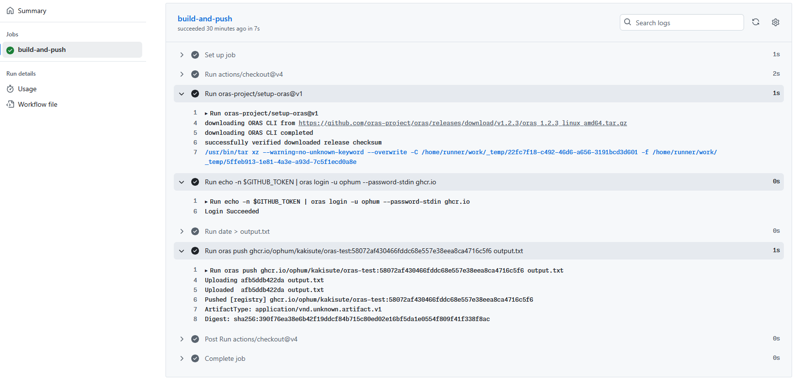
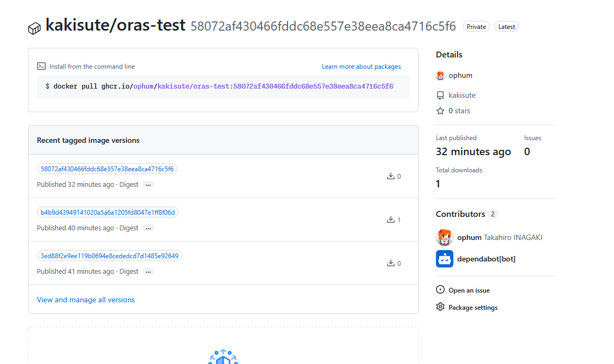

OCI レジストリはコンテナのイメージを保存するのに使うことが多いですが、コンテナイメージ以外のデータを保存することも可能です。

バイナリファイルなどビルドの成果物管理に OCI レジストリが使えると便利そうだなと思ったのでその検証をしてみました。

oras というプロジェクトがまさにそれを行っています。

## oras で ghcr.io にファイルを push するワークフローを GitHub Actions で動かす

以下のような workflow を定義します。

- `oras-project/setup-oras@v1`で oras コマンドを利用できるようにします。
- `oras login` ghcr.io にログインします。
- 成果物として日付を output.txt に書き込みます
- `oras push`で ghcr.io に output.txt を push します。
  - タグには commit hash を使います

```yaml
name: Build binary push to github registry using oras
on:
  push:
    branches:
      - main

jobs:
  build-and-push:
    runs-on: ubuntu-latest
    permissions:
      packages: write
    steps:
      - uses: actions/checkout@v4
      - uses: oras-project/setup-oras@v1
      - run: echo -n $GITHUB_TOKEN | oras login -u ${{ github.actor }} --password-stdin ghcr.io
        env:
          GITHUB_TOKEN: ${{ secrets.GITHUB_TOKEN }}
      - run: date > output.txt
      - run: oras push ghcr.io/ophum/kakisute/oras-test:${{ github.sha }} output.txt
```

以下のように実行できました。



Packages のページでも確認できます。


## oras コマンドでファイルを pull する

### public なパッケージの場合(oras)

public なパッケージだと認証なしで pull できます。

#### タグを確認 (oras public)

```bash
hum@ryzen5pc:~/oras-test$ oras repo tags ghcr.io/ophum/kakisute/oras-test
3ed88f2e9ee119b0694e8cededcd7d1485e92649
b4b9d43949141020a5a6a1205fd8047e1ff8f06d
58072af430466fddc68e557e38eea8ca4716c5f6
```

#### pull する (oras public)

```bash
hum@ryzen5pc:~/oras-test$ ls
hum@ryzen5pc:~/oras-test$ oras pull ghcr.io/ophum/kakisute/oras-test:b4b9d43949141020a5a6a1205fd8047e1ff8f06d
✓ Pulled      output.txt                                                     29/29  B 100.00%  484µs
  └─ sha256:2caee7636353b06e490e048bf0ff323347aaa7b59a4fa2a87f51e46687d3e2ee
✓ Pulled      application/vnd.oci.image.manifest.v1+json                   589/589  B 100.00%  137µs
  └─ sha256:6519123c64ebe8ab9b3e0593556b3786db9375e5bfbefe07155eb43d884f8dc0
Pulled [registry] ghcr.io/ophum/kakisute/oras-test:b4b9d43949141020a5a6a1205fd8047e1ff8f06d
Digest: sha256:6519123c64ebe8ab9b3e0593556b3786db9375e5bfbefe07155eb43d884f8dc0
```

`output.txt`が存在することと書き込まれた内容を確認します。

```bash
hum@ryzen5pc:~/oras-test$ ls
output.txt
hum@ryzen5pc:~/oras-test$ cat output.txt
Sun Jun 29 05:29:16 UTC 2025
```

### private なパッケージの場合 (oras)

#### oras login

oras login するか-u, -p オプションで認証情報を指定します。

gh コマンドのトークンを利用してみます。

```bash
hum@ryzen5pc:~/oras-test$ gh auth login -h github.com -p https --scopes read:packages --web

! First copy your one-time code: 156D-89E5
Press Enter to open github.com in your browser...
✓ Authentication complete.
- gh config set -h github.com git_protocol https
✓ Configured git protocol
! Authentication credentials saved in plain text
✓ Logged in as ophum
hum@ryzen5pc:~/oras-test$ gh auth token | oras login -u ophum --password-stdin ghcr.io
Login Succeeded
```

#### pull する(oras private)

```bash
hum@ryzen5pc:~/oras-test$ oras pull ghcr.io/ophum/kakisute/oras-test:b4b9d43949141020a5a6a1205fd8047e1ff8f06d
✓ Pulled      output.txt                                                     29/29  B 100.00%  667µs
  └─ sha256:2caee7636353b06e490e048bf0ff323347aaa7b59a4fa2a87f51e46687d3e2ee
✓ Pulled      application/vnd.oci.image.manifest.v1+json                   589/589  B 100.00%     0s
  └─ sha256:6519123c64ebe8ab9b3e0593556b3786db9375e5bfbefe07155eb43d884f8dc0
Pulled [registry] ghcr.io/ophum/kakisute/oras-test:b4b9d43949141020a5a6a1205fd8047e1ff8f06d
Digest: sha256:6519123c64ebe8ab9b3e0593556b3786db9375e5bfbefe07155eb43d884f8dc0
```

```bash
hum@ryzen5pc:~/oras-test$ cat output.txt
Sun Jun 29 05:29:16 UTC 2025
```

## curl でファイルを pull する

### public なパッケージの場合 (curl)

#### トークンを作成 (curl public)

```bash
hum@ryzen5pc:~/oras-test$ curl -so "token.json" "https://ghcr.io/token?service=ghcr.io&scope=repository:ophum/kakisute/oras-test:pull"
```

#### タグを確認 (curl public)

作成したトークンを Authorization ヘッダーに入れて実行します。

```bash
hum@ryzen5pc:~/oras-test$ curl -s -H "Authorization: Bearer $(cat token.json | jq -r .token)" https:
//ghcr.io/v2/ophum/kakisute/oras-test/tags/list | jq
{
  "name": "ophum/kakisute/oras-test",
  "tags": [
    "3ed88f2e9ee119b0694e8cededcd7d1485e92649",
    "b4b9d43949141020a5a6a1205fd8047e1ff8f06d",
    "58072af430466fddc68e557e38eea8ca4716c5f6"
  ]
}
```

#### マニフェストを確認 (curl public)

```bash
hum@ryzen5pc:~/oras-test$ curl -so manifest.json \
    -H "Accept: application/vnd.oci.image.manifest.v1+json" \
    -H "Authorization: Bearer $(cat token.json | jq -r .token)" \
    https://ghcr.io/v2/ophum/kakisute/oras-test/manifests/3ed88f2e9ee119b0694e8cededcd7d1485e92649
hum@ryzen5pc:~/oras-test$ cat manifest.json | jq
{
  "schemaVersion": 2,
  "mediaType": "application/vnd.oci.image.manifest.v1+json",
  "artifactType": "application/vnd.unknown.artifact.v1",
  "config": {
    "mediaType": "application/vnd.oci.empty.v1+json",
    "digest": "sha256:44136fa355b3678a1146ad16f7e8649e94fb4fc21fe77e8310c060f61caaff8a",
    "size": 2,
    "data": "e30="
  },
  "layers": [
    {
      "mediaType": "application/vnd.oci.image.layer.v1.tar",
      "digest": "sha256:9378c2a8b36f97d973b728a0d944356874903b71c83fcdb68724ef3c19a687a1",
      "size": 29,
      "annotations": {
        "org.opencontainers.image.title": "output.txt"
      }
    }
  ],
  "annotations": {
    "org.opencontainers.image.created": "2025-06-29T05:28:08Z"
  }
}
```

#### output.txt をダウンロードする (curl public)

.layers[0].digest を指定してダウンロードします。

```bash
hum@ryzen5pc:~/oras-test$ curl -L -s \
    -H "Authorization: Bearer $(cat token.json | jq -r .token)" \
    "https://ghcr.io/v2/ophum/kakisute/oras-test/blobs/$(cat manifest.json | jq -r '.layers[0].digest')"
Sun Jun 29 05:28:08 UTC 2025
```

### private なパッケージの場合

#### トークンを作成 (curl private)

public の時と同じ URL に Basic 認証付きで実行します。

```bash
hum@ryzen5pc:~/oras-test$ curl -so "token.json" -u ophum:$(gh auth token) "https://ghcr.io/token?service=ghcr.io&scope=repository:ophum/kakisute/oras-test:pull"
```

#### タグを確認 (curl private)

あとは public の時と同じです。
作成したトークンを Authorization ヘッダーに入れて実行します。

```bash
hum@ryzen5pc:~/oras-test$ curl -s -H "Authorization: Bearer $(cat token.json | jq -r .token)" https://ghcr.io/v2/ophum/kakisute/oras-test/tags/list | jq
{
  "name": "ophum/kakisute/oras-test",
  "tags": [
    "3ed88f2e9ee119b0694e8cededcd7d1485e92649",
    "b4b9d43949141020a5a6a1205fd8047e1ff8f06d",
    "58072af430466fddc68e557e38eea8ca4716c5f6"
  ]
}
```

#### マニフェストを確認 (curl private)

```bash
hum@ryzen5pc:~/oras-test$ curl -so manifest.json \
    -H "Accept: application/vnd.oci.image.manifest.v1+json" \
    -H "Authorization: Bearer $(cat token.json | jq -r .token)" \
    https://ghcr.io/v2/ophum/kakisute/oras-test/manifests/3ed88f2e9ee119b0694e8cededcd7d1485e92649
hum@ryzen5pc:~/oras-test$ cat manifest.json | jq
{
  "schemaVersion": 2,
  "mediaType": "application/vnd.oci.image.manifest.v1+json",
  "artifactType": "application/vnd.unknown.artifact.v1",
  "config": {
    "mediaType": "application/vnd.oci.empty.v1+json",
    "digest": "sha256:44136fa355b3678a1146ad16f7e8649e94fb4fc21fe77e8310c060f61caaff8a",
    "size": 2,
    "data": "e30="
  },
  "layers": [
    {
      "mediaType": "application/vnd.oci.image.layer.v1.tar",
      "digest": "sha256:9378c2a8b36f97d973b728a0d944356874903b71c83fcdb68724ef3c19a687a1",
      "size": 29,
      "annotations": {
        "org.opencontainers.image.title": "output.txt"
      }
    }
  ],
  "annotations": {
    "org.opencontainers.image.created": "2025-06-29T05:28:08Z"
  }
}
```

#### output.txt をダウンロードする (curl private)

.layers[0].digest を指定してダウンロードします。

```bash
hum@ryzen5pc:~/oras-test$ curl -L -s \
    -H "Authorization: Bearer $(cat token.json | jq -r .token)" \
    "https://ghcr.io/v2/ophum/kakisute/oras-test/blobs/$(cat manifest.json | jq -r '.layers[0].digest')"
Sun Jun 29 05:28:08 UTC 2025
```

## References

- https://oras.land/docs/
- [Manually Downloading Container Images (Docker, Github Packages)](https://tech.michaelaltfield.net/2024/09/03/container-download-curl-wget/)
- [GitHub CLI を使って PAT 無しで ghcr.io にログインする](https://zenn.dev/hrko/scraps/350e89e4479c8c)
