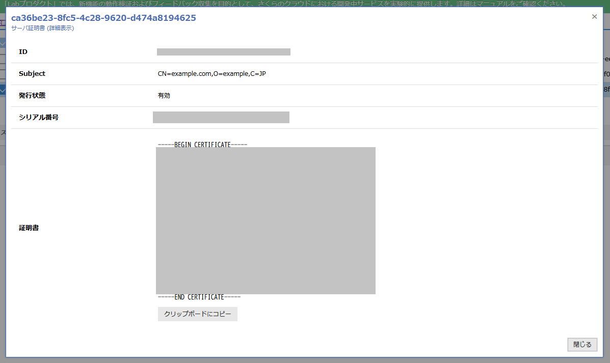

# k8s ingress-nginx の Client 証明書認証を試す

## kind で k8s を構築する

```bash
hum@ryzen5pc:~$ kind create cluster
Creating cluster "kind" ...
 ✓ Ensuring node image (kindest/node:v1.30.0) 🖼
 ✓ Preparing nodes 📦
 ✓ Writing configuration 📜
 ✓ Starting control-plane 🕹️
 ✓ Installing CNI 🔌
 ✓ Installing StorageClass 💾
Set kubectl context to "kind-kind"
You can now use your cluster with:

kubectl cluster-info --context kind-kind

Not sure what to do next? 😅  Check out https://kind.sigs.k8s.io/docs/user/quick-start/
```

## ingress-nginx をデプロイ

https://kubernetes.github.io/ingress-nginx/deploy/#quick-start

```bash
hum@ryzen5pc:~$ kubectl apply -f https://raw.githubusercontent.com/kubernetes/ingress-nginx/controller-v1.13.3/deploy/static/provider/cloud/deploy.yaml
namespace/ingress-nginx created
serviceaccount/ingress-nginx created
serviceaccount/ingress-nginx-admission created
role.rbac.authorization.k8s.io/ingress-nginx created
role.rbac.authorization.k8s.io/ingress-nginx-admission created
clusterrole.rbac.authorization.k8s.io/ingress-nginx created
clusterrole.rbac.authorization.k8s.io/ingress-nginx-admission created
rolebinding.rbac.authorization.k8s.io/ingress-nginx created
rolebinding.rbac.authorization.k8s.io/ingress-nginx-admission created
clusterrolebinding.rbac.authorization.k8s.io/ingress-nginx created
clusterrolebinding.rbac.authorization.k8s.io/ingress-nginx-admission created
configmap/ingress-nginx-controller created
service/ingress-nginx-controller created
service/ingress-nginx-controller-admission created
deployment.apps/ingress-nginx-controller created
job.batch/ingress-nginx-admission-create created
job.batch/ingress-nginx-admission-patch created
ingressclass.networking.k8s.io/nginx created
validatingwebhookconfiguration.admissionregistration.k8s.io/ingress-nginx-admission created
```

## 証明書を作成する

認証局にはさくらのクラウドのマネージド PKI を利用しました。

### サーバー証明書を作成する

秘密鍵と公開鍵を生成します。公開鍵を利用してマネージド PKI で証明書を発行します。

```
openssl genrsa > server-key.pem
openssl rsa -pubout -in server-key.pem server-pub.pem
```


証明書をコピーし server-cert.pem として保存しておきます。


### クライアント証明作成する

クライアント証明書はメールを利用してマネージド PKI で証明書を発行します。


以下のようなメールが届くので、鍵の生成・証明書の発行を行います。(鍵の生成はブラウザで行われる)
完了すると pkcs.p12 というファイルをダウンロードできます。


pkcs.p12 をダブルクリックしインポートしておきます。


## ingress とアプリケーション(nginx)をデプロイする

CA 証明書の Secret を作成する(マネージド PKI の認証局の証明書)

```bash
hum@ryzen5pc:~/nginx-ingress-client-cert-auth-test$ kubectl create secret generic ca-secret --from-file=ca.crt=cert.pem
secret/ca-secret created
```

tls 用の Secret を作成する

```bash
hum@ryzen5pc:~/nginx-ingress-client-cert-auth-test$ kubectl create secret generic tls-secret --from-
file=tls.crt=server-cert.pem --from-file=tls.key=server-key.pem
secret/tls-secret created
```

Ingress/Deployment/Service を作成する

```yaml
apiVersion: networking.k8s.io/v1
kind: Ingress
metadata:
  annotations:
    nginx.ingress.kubernetes.io/auth-tls-verify-client: "on"
    nginx.ingress.kubernetes.io/auth-tls-secret: "default/ca-secret"
    nginx.ingress.kubernetes.io/auth-tls-verify-depth: "1"
    nginx.ingress.kubernetes.io/auth-tls-pass-certificate-to-upstream: "true"
  name: nginx-test
  namespace: default
spec:
  ingressClassName: nginx
  rules:
    - host: example.com
      http:
        paths:
          - path: /
            pathType: Prefix
            backend:
              service:
                name: nginx-svc
                port:
                  number: 80
  tls:
    - hosts:
        - example.com
      secretName: tls-secret
---
apiVersion: apps/v1
kind: Deployment
metadata:
  name: nginx-test
spec:
  replicas: 1
  selector:
    matchLabels:
      app: nginx-test
  template:
    metadata:
      labels:
        app: nginx-test
    spec:
      containers:
        - name: nginx
          image: nginx
          ports:
            - containerPort: 80
---
apiVersion: v1
kind: Service
metadata:
  name: nginx-svc
spec:
  selector:
    app: nginx-test
  ports:
    - protocol: TCP
      port: 80
      targetPort: 80
```

```bash
hum@ryzen5pc:~/nginx-ingress-client-cert-auth-test$ vim deploy.yaml
hum@ryzen5pc:~/nginx-ingress-client-cert-auth-test$ kubectl apply -f deploy.yaml
ingress.networking.k8s.io/nginx-test created
deployment.apps/nginx-test created
service/nginx-svc created
```

```bash
hum@ryzen5pc:~/nginx-ingress-client-cert-auth-test$ kubectl get pods
NAME                          READY   STATUS    RESTARTS   AGE
nginx-test-66b9959c76-rvr6n   1/1     Running   0          14s
```

```
hum@ryzen5pc:~/nginx-ingress-client-cert-auth-test$ kubectl port-forward -n ingress-nginx svc/ingress-nginx-controller 8080:80
Forwarding from 127.0.0.1:8080 -> 80
Forwarding from [::1]:8080 -> 80
```

## サイトにアクセスしてみる

クライアント証明書を求められる。インポートしたクライアント証明書を選択することでアクセスできる。


証明書を送信しない場合、400 エラーになる。


証明書を送信することでサイトにアクセスすることができた。


