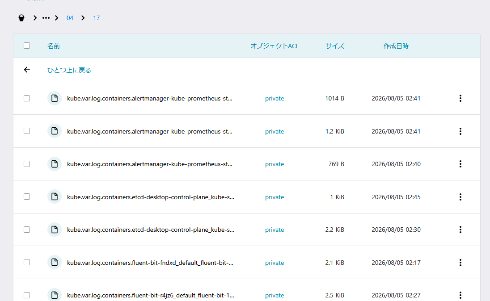

# k8s fluent-bitでさくらのオブジェクトストレージにログを保存する

## fluent-bitをデプロイ

helmでデプロイします。

※ envでアクセスキーとシークレットアクセスキーを指定していますが、Secretを利用し、envFromで読み込むがよいと思います。

values.yaml
```yaml
env:
  - name: AWS_ACCESS_KEY_ID
    value: <アクセスキー>
  - name: AWS_SECRET_ACCESS_KEY
    value: <シークレットアクセスキー>
config:
  outputs: |
    [OUTPUT]
        Name                      s3
        Match                     kube.*

        endpoint                  s3.isk01.sakurastorage.jp
        bucket                    <bucket名>
        region                    jp-north-1

        store_dir                 /buffers/s3
        store_dir_limit_size      10G

        total_file_size           100M
        upload_timeout            10m

        use_put_object            Off
        preserve_data_ordering    On

        compression               gzip

        s3_key_format             /kubernetes/%Y/%m/%d/%H/$TAG-$UUID.gz
        s3_key_format_tag_delimiters .-_

        Retry_Limit               False

```

```bash
helm upgrade --install fluent-bit oci://ghcr.io/fluent/helm-charts/fluent-bit --version 0.57.9 -f values.yaml 
```

デプロイするとログがオブジェクトストレージにアップロードされます。



## clickhouse localで参照してみる

ログをオブジェクトストレージに保存することができました。
参照の際にawscliでダウンロードして閲覧というのも面倒なのでclickhouse localを利用し参照してみます。

clickhouseコマンドをダウンロード。
※ `You can also install it: sudo ./clickhouse install`といったログが出力されますが、インストールは不要なので実行しません。

```bash
curl https://clickhouse.com/ | sh
```

config.xml
```xml
<clickhouse>
    <s3>
        <sakura-s3>
            <endpoint>https://s3.isk01.sakurastorage.jp</endpoint>
            <access_key_id>アクセスキー</access_key_id>
            <secret_access_key>シークレットアクセスキー</secret_access_key>
            <region>jp-north-1</region>
        </sakura-s3>
    </s3>
    <url_scheme_mappers>
        <s3>
            <to>https://s3.isk01.sakurastorage.jp/{bucket}</to>
        </s3>
    </url_scheme_mappers>
</clickhouse>
```

設定ファイルを指定して起動する
```bash
./clickhouse local --config config.xml
```

### クエリを実行してみる

```
:) SELECT COUNT(*) FROM s3('s3://<バケット名>/kubernetes/2026/08/04/*/*.gz')

SELECT COUNT(*)
FROM s3('s3://<バケット名>/kubernetes/2026/08/04/*/*.gz')

Query id: 66068d47-ae2a-4113-92f4-1e1518f6c0cd

   ┌─COUNT()─┐
1. │    3269 │
   └─────────┘

1 row in set. Elapsed: 1.365 sec. Processed 3.27 thousand rows, 697.00 B (2.39 thousand rows/s., 510.62 B/s.)
Peak memory usage: 49.14 MiB.
```

```
:) SELECT * FROM s3('s3://<バケット名>/kubernetes/2026/08/04/*/*.gz') LIMIT 1

SELECT *
FROM s3('s3://<バケット名>/kubernetes/2026/08/04/*/*.gz')
LIMIT 1

Query id: be04f612-ff25-4674-a727-709213dbe26f

Row 1:
──────
date:       2026-08-05 02:30:10.575731000
time:       2026-08-05 02:30:10.575731477
stream:     stderr
_p:         F
log:        time=2026-08-04T17:30:10.575Z level=INFO source=main.go:196 msg="Starting Alertmanager" version="(version=0.33.1, branch=HEAD, revision=2c8da51e03f3dbbed24f9711ca2d76aab4eef9c5)"
kubernetes: {
  "annotations": {
   "kubectl.kubernetes.io\/default-container": "alertmanager"
  },
  "container_hash": "quay.io\/prometheus\/alertmanager@sha256:9e082985f56f4c8c9f724e18f2288c6708f472e56a5286b8863d080434ea065d",
  "container_image": "quay.io\/prometheus\/alertmanager:v0.33.1",
  "container_name": "alertmanager",
  "docker_id": "4ab025b5161eb1ccfa4c34d4e34fef0159aace421e82c22a050c33716e4ee8f0",
  "host": "desktop-control-plane",
  "labels": {
   "alertmanager": "kube-prometheus-stack-alertmanager",
   "app.kubernetes.io\/instance": "kube-prometheus-stack-alertmanager",
   "app.kubernetes.io\/managed-by": "prometheus-operator",
   "app.kubernetes.io\/name": "alertmanager",
   "app.kubernetes.io\/version": "0.33.1",
   "apps.kubernetes.io\/pod-index": "0",
   "controller-revision-hash": "alertmanager-kube-prometheus-stack-alertmanager-7c6cc476df",
   "statefulset.kubernetes.io\/pod-name": "alertmanager-kube-prometheus-stack-alertmanager-0"
  },
  "namespace_name": "monitoring",
  "pod_id": "f44e7d1f-b810-484f-a2c7-7060d2615afc",
  "pod_ip": "10.244.0.12",
  "pod_name": "alertmanager-kube-prometheus-stack-alertmanager-0"
}

1 row in set. Elapsed: 0.935 sec. 
```

### 絞り込んでみる
```
:) SELECT time, log, kubernetes.namespace_name, kubernetes.pod_name FROM s3('s3://<バケット名>/kubernetes/2026/08/04/*/*.gz') WHERE kubernetes.namespace_name = 'kube-system' ORDER BY time DESC LIMIT 5 \G

SELECT
    time,
    log,
    kubernetes.namespace_name,
    kubernetes.pod_name
FROM s3('s3://<バケット名>/kubernetes/2026/08/04/*/*.gz')
WHERE kubernetes.namespace_name = 'kube-system'
ORDER BY time DESC
LIMIT 5

Query id: 89a80f9e-a607-469b-9209-83a410513909

Row 1:
──────
time:                      2026-08-05 03:01:28.440224342
log:                       ᴺᵁᴸᴸ
kubernetes.namespace_name: kube-system
kubernetes.pod_name:       etcd-desktop-control-plane

Row 2:
──────
time:                      2026-08-05 03:01:28.440193252
log:                       ᴺᵁᴸᴸ
kubernetes.namespace_name: kube-system
kubernetes.pod_name:       etcd-desktop-control-plane

Row 3:
──────
time:                      2026-08-05 03:01:28.423107303
log:                       ᴺᵁᴸᴸ
kubernetes.namespace_name: kube-system
kubernetes.pod_name:       etcd-desktop-control-plane

Row 4:
──────
time:                      2026-08-05 02:59:20.721357615
log:                       I0804 17:59:20.721099       1 node.go:197] "NodeIPs changed for the node" node="desktop-control-plane" newNodeIPs=["172.18.0.2","fc00:f853:ccd:e793::2"] oldNodeIPs=["172.18.0.2"]
kubernetes.namespace_name: kube-system
kubernetes.pod_name:       kube-proxy-krqjb

Row 5:
──────
time:                      2026-08-05 02:58:48.853256415
log:                       I0804 17:58:48.853045       1 node.go:197] "NodeIPs changed for the node" node="desktop-control-plane" newNodeIPs=["172.18.0.2","fc00:f853:ccd:e793::2"] oldNodeIPs=["172.18.0.2"]
kubernetes.namespace_name: kube-system
kubernetes.pod_name:       kube-proxy-krqjb

5 rows in set. Elapsed: 1.260 sec. Processed 3.28 thousand rows, 732.88 KB (2.60 thousand rows/s., 581.72 KB/s.)
Peak memory usage: 44.78 MiB.
```

## 気になったこと

k8sのノード数やPod数が多い場合、各ノードからオブジェクトストレージにAPIリクエストされるため、集約するなどの工夫が必要になるかもしれません。
また、すべてのnamespaceのログが時間ごとに保存されるため、特定のnamespaceだけに絞りたい場合は保存するパスを工夫するか、`s3()`で指定するパスを工夫する必要がありそうです。

## さいごに

fluent-bitを用いてさくらのオブジェクトストレージにログを保存することができました。
またclickhouse localを利用することで参照することができました。
懸念点はありつつも小規模であれば十分だと感じました。
